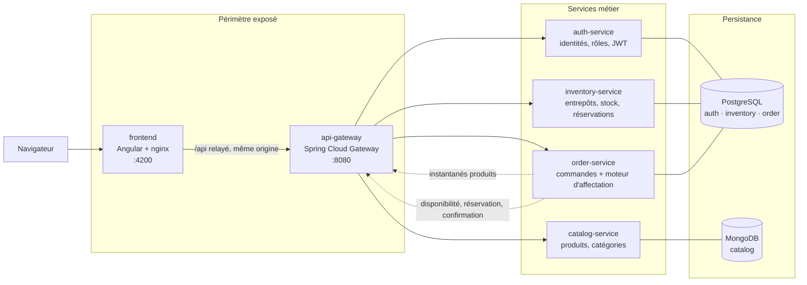
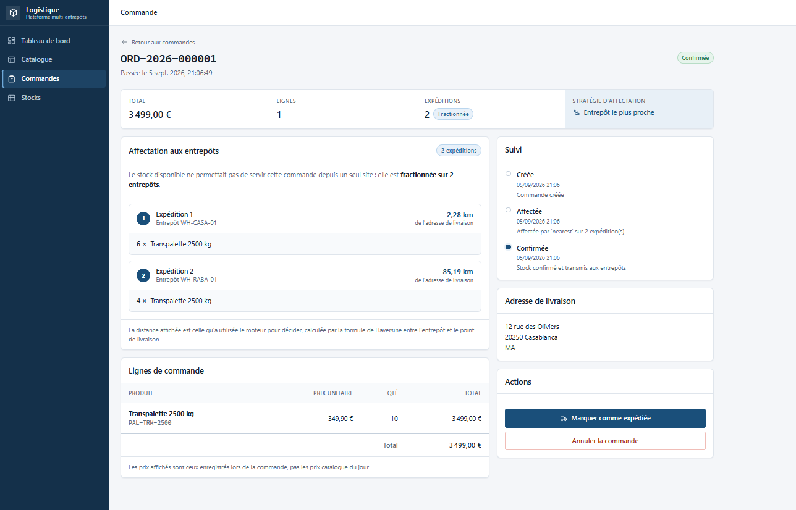
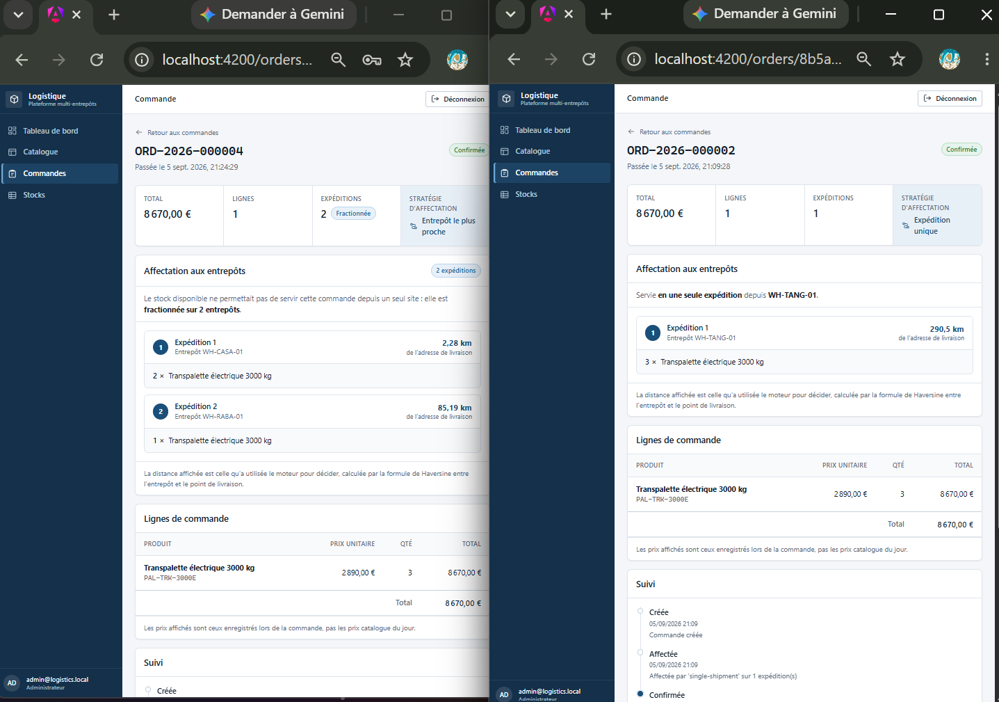
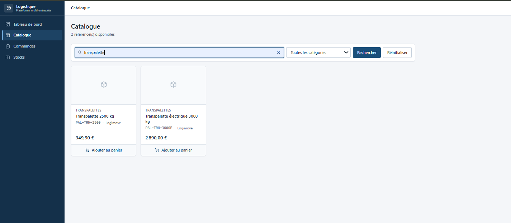
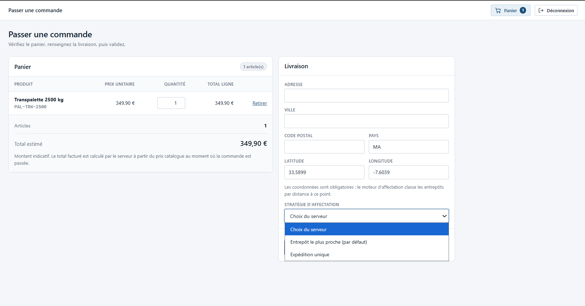
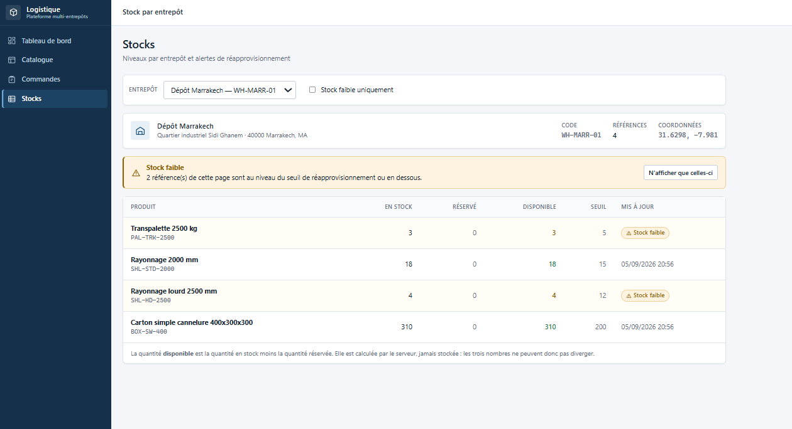
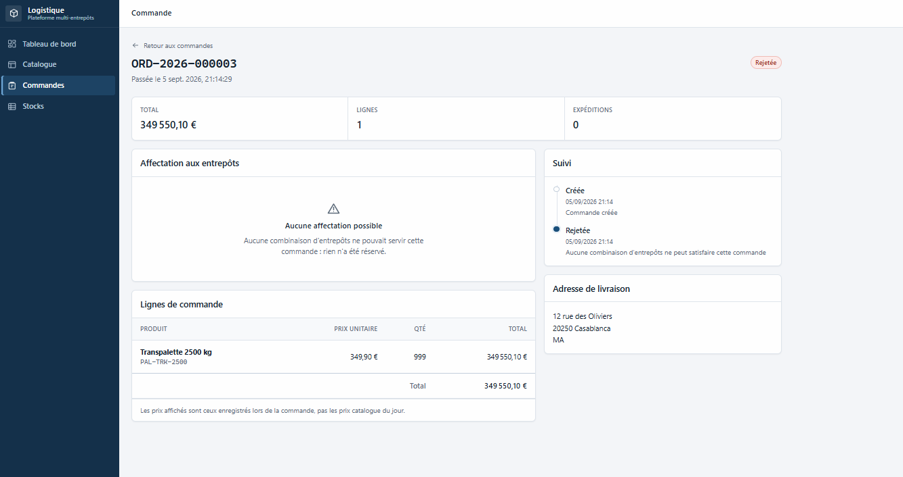

# Plateforme Microservices de Gestion Logistique

*Multi-Warehouse Logistics Platform*

Une plateforme distribuée qui détermine, pour chaque commande passée, **quel entrepôt l'expédie — et
pourquoi**.

Java 17 · Spring Boot 3 · Spring Cloud Gateway · PostgreSQL · MongoDB · Angular 21 · Docker

---

## Présentation

Cette plateforme centralise la gestion d'un catalogue de produits, de stocks répartis sur plusieurs
entrepôts géographiques et de commandes clients. Elle est découpée en quatre services métier
indépendants, exposés derrière une API Gateway, avec une interface Angular.

Son intérêt ne réside pas dans le CRUD, mais dans un **moteur d'affectation d'entrepôt** et dans le
protocole de cohérence distribuée qui rend ses décisions sûres à appliquer.

## Problématique

Une entreprise qui détient du stock dans plusieurs entrepôts doit trancher à chaque commande : *quel
site la sert ?* La réponse naïve — le plus proche — s'effondre dès qu'aucun site ne détient la
totalité. Les vraies questions apparaissent alors. Faut-il fractionner sur deux entrepôts proches, ou
envoyer un seul colis depuis un site plus lointain ? Que faire si le client commande dix unités et
que le réseau n'en détient que six ? Que devient le stock promis à une commande qui n'est jamais
confirmée ?

## Solution

La plateforme répond explicitement à ces questions.

**Deux stratégies interchangeables, et elles divergent réellement.** À stock identique, pour trois
transpalettes électriques livrés à Casablanca :

| Stratégie | Résultat | Optimise |
|---|---|---|
| `nearest` — Entrepôt le plus proche | 2 expéditions : Casablanca (2 km) + Rabat (85 km) | les kilomètres parcourus |
| `single-shipment` — Expédition unique | 1 expédition : Tanger (291 km) | le nombre de colis |

Les deux plans sont complets et corrects. Chacun est meilleur sur l'axe qu'il optimise. Choisir entre
eux relève d'une décision métier : le code en fait donc une décision explicite — une stratégie est une
classe plus une ligne de configuration.

---

## Architecture



Chaque service possède sa propre base et **aucun service ne lit les tables d'un autre**. Les
références inter-services sont des colonnes logiques sans clé étrangère, validées à la frontière
applicative.

Les documents de conception complets — modèle de données, UML, diagrammes de séquence, contrat REST —
se trouvent dans [`docs/`](docs/).

---

## Stack technique

| Couche | Choix |
|---|---|
| Langage / exécution | Java 17, Spring Boot 3.3 |
| Périmètre exposé | Spring Cloud Gateway (réactif) |
| Persistance | PostgreSQL 16 (transactionnel), MongoDB 7 (catalogue) |
| Migrations | Flyway, avec `ddl-auto: validate` |
| Sécurité | Spring Security resource server, JWT RS256, JWKS |
| Front-end | Angular 21, composants standalone, signals, zoneless |
| Documentation d'API | springdoc-openapi sur chaque service |
| Build | Maven multi-modules, `npm` pour le front-end |
| Exécution | Docker Compose, une seule commande |
| Tests | JUnit 5, Mockito, AssertJ, Testcontainers, Vitest |

---

## Décisions techniques

Chacune de ces décisions a été un vrai carrefour. L'alternative écartée est indiquée, car une
décision sans alternative écartée n'est pas une décision.

### Verrouillage pessimiste sur le stock, optimiste ailleurs

Réserver du stock prend un `SELECT … FOR UPDATE` sur les lignes concernées, **toujours dans l'ordre
croissant de la clé primaire**.

*Pourquoi pas un verrouillage optimiste.* Deux commandes lisent la même ligne, réussissent toutes
deux à la lecture, et l'une échoue au commit ; l'appelant réessaie, relit, et peut reperdre. Or, à
mesure que les dernières unités partent, le nombre de concurrents augmente exactement quand la
probabilité de gagner diminue — le taux d'échec est maximal au moment où le système doit le mieux se
comporter. Le verrouillage pessimiste fait attendre la seconde transaction quelques millisecondes,
puis lui répond sur la quantité réellement restante.

*Pourquoi l'ordre.* Deux commandes touchant les mêmes deux lignes dans un ordre inverse
s'interbloqueraient. Un ordre de verrouillage global unique rend cela impossible par construction, et
pas seulement improbable.

*Le coût, assumé.* Les écrivains se sérialisent sur les lignes disputées : le débit par produit est
donc borné par la durée d'une transaction. C'est le bon compromis pour du stock, où une réponse
fausse est pire qu'une réponse lente — et le mauvais compromis pour le catalogue, qui utilise donc un
verrouillage optimiste.

*Et si le verrouillage était malgré tout défaillant :* la contrainte
`CHECK (quantity_reserved <= quantity_on_hand)` refuse l'écriture. Le verrouillage est la stratégie ;
la contrainte est la garantie.

### Une réservation en deux temps, pas un décrément

Entre la lecture de la disponibilité et le décrément, une autre commande peut prendre les mêmes
unités. Réserver et confirmer sont deux étapes distinctes, ce qui apporte trois choses : la
réservation est atomique sur toutes les lignes, elle offre une **action compensatoire** si une étape
ultérieure échoue, et son TTL garantit qu'un orchestrateur qui plante ne peut pas immobiliser du
stock — un balayage périodique le libère. Le numéro de commande sert de référence de réservation et
est unique, ce qui rend un réessai sans danger.

### MongoDB pour le catalogue uniquement

Une fiche technique a des attributs différents selon la catégorie : un transpalette a une
`capacityKg`, un carton a un `flute` et un `burstStrengthKpa`. En relationnel, cela donne une table
large et creuse, un anti-pattern EAV, ou une table par catégorie. Ici, la catégorie déclare un
`attributeSchema` et le produit porte un objet imbriqué validé contre lui — **le schéma est une
donnée**, donc ajouter une catégorie ne demande aucune migration.

*Le contre-argument honnête :* du `JSONB` PostgreSQL avec un index GIN ferait également l'affaire.
MongoDB est retenu parce que le catalogue est le seul contexte où le document *est* l'agrégat. Ce qui
serait indéfendable, c'est l'inverse — mettre le stock ou les commandes dans MongoDB et perdre les
garanties transactionnelles dont dépend le moteur d'affectation.

### RS256 avec un JWKS publié, plutôt qu'un secret partagé

Seul `auth-service` détient la clé privée ; tous les autres composants valident via
`/.well-known/jwks.json`. Avec un secret HS256 partagé, compromettre n'importe quel service
permettrait de forger un jeton administrateur. Les appels de service à service utilisent un **compte
technique** portant `ROLE_SERVICE` plutôt que de rejouer le jeton du client : les endpoints internes
refusent donc une session navigateur, même passée par la gateway.

### La gateway authentifie ; chaque service autorise

La gateway valide le jeton et supprime tout en-tête `X-User-*` fourni par le client avant de les
réécrire à partir des claims vérifiés. Chaque service valide ensuite le jeton **à nouveau** et
applique ses propres contrôles de rôle. L'isolation réseau est un détail de déploiement, pas une
garantie de sécurité : un service doit rester sûr même s'il est un jour atteint directement.

### Un moteur d'affectation sans entrées-sorties

Les implémentations de `WarehouseAllocationStrategy` reçoivent un instantané de disponibilité et
renvoient un plan. Aucun repository, aucun client HTTP, aucune horloge, aucun aléa. Chaque scénario
d'affectation est donc un test unitaire simple, sans mock ni conteneur, et chaque comparateur se
termine par un départage déterministe : un plan est reproductible plutôt que dépendant de l'ordre
d'arrivée de l'instantané.

### Instantanés produits dénormalisés sur les lignes de commande

Une ligne de commande stocke le SKU, le libellé et le prix unitaire tels qu'ils étaient au moment de
la commande. Un produit renommé ou revalorisé le mois suivant ne doit pas réécrire ce que le client a
accepté, et une commande passée doit rester lisible même si `catalog-service` est indisponible.

### RFC 7807 partout

Chaque service — et la gateway — renvoie ses erreurs en `application/problem+json`, avec des
informations structurées : quel champ a échoué à la validation, quelles lignes n'ont pas pu être
affectées, combien le réseau détient réellement. Le front-end analyse une seule forme de document
quelle que soit l'erreur, et peut dire au client « nous détenons 6 des 10 unités demandées » au lieu
de « la requête a échoué ».

### Aucun module Maven partagé

Chaque service duplique son `GlobalExceptionHandler`, son `PagedResponse` et sa configuration de
resource server — environ 150 lignes. Un module technique commun créerait un couplage de release où
modifier une classe impose de reconstruire tous les services, ce que le découpage en microservices
vise précisément à éviter. Le code dupliqué est du code d'infrastructure, pas de la logique métier.

---

## Lancement local

Le seul prérequis est **Docker avec Compose v2**. Le JDK, Maven et Node vivent tous à l'intérieur des
images de build.

```bash
git clone <url-du-depot> logistics-microservices-platform
cd logistics-microservices-platform

cp .env.example .env        # puis éditez-le : toutes les valeurs sont des marqueurs
docker compose up --build   # premier lancement : six images à construire, quelques minutes

./scripts/seed-demo-data.sh # quatre entrepôts, huit produits, stocks réalistes
```

Ouvrez ensuite **<http://localhost:4200>**.

| Compte | Identifiants |
|---|---|
| Administrateur | `admin@logistics.local` — mot de passe dans votre `.env` (`BOOTSTRAP_ADMIN_PASSWORD`) |
| Client | `demo@logistics.local` / `Demo-Pass-2026` (créé par le script de démonstration) |

> **Sous Windows :** le chemin du dépôt ne doit contenir que des caractères ASCII. Docker Compose
> construit via `buildx bake`, qui dérive un en-tête gRPC du chemin du contexte de build ; un accent
> quelque part dans ce chemin fait échouer la poignée de main avec
> `header "x-docker-expose-session-sharedkey" contains value with non-printable ASCII characters`.
> Un `docker build` classique n'est pas affecté, ce qui rend le diagnostic déroutant. Clonez plutôt
> dans un chemin du type `C:\dev\logistics-microservices-platform`.

### Ports et documentation

| | URL |
|---|---|
| Application | <http://localhost:4200> |
| API via nginx (même origine) | <http://localhost:4200/api/v1/…> |
| API Gateway | <http://localhost:8080> |
| Swagger — auth · catalog · inventory · order | `:8081` · `:8082` · `:8083` · `:8084` `/swagger-ui.html` |

Seuls la gateway et le front-end publient un port dans `docker-compose.yml`. Les ports de service
ci-dessus proviennent de `docker-compose.override.yml`, que Compose fusionne automatiquement pour le
développement local.

---

## Données de démonstration

Le script [`scripts/seed-demo-data.sh`](scripts/seed-demo-data.sh) charge un jeu de données réaliste
**via l'API publique**, jamais en SQL. C'est délibéré : le script traverse la même validation, les
mêmes contrôles de rôle et le même moteur d'affectation qu'un vrai client. Un contrat rompu échoue
donc là, et non pendant une démonstration.

Il crée quatre entrepôts aux coordonnées réelles (Casablanca, Rabat, Tanger, Marrakech), six
catégories avec leurs schémas d'attributs, huit produits et vingt et une lignes de stock. Il est
réexécutable sans risque : les éléments déjà présents sont détectés et laissés intacts.

**La répartition du stock est conçue, pas aléatoire.** Chaque produit place le moteur dans une
situation précise à observer :

1. **Commandez 10 « Transpalette 2500 kg ».** Aucun entrepôt n'en détient dix : la commande est
   fractionnée. L'écran de suivi nomme chaque entrepôt et la distance qui a motivé le choix.
2. **Comparez les deux stratégies** en passant deux fois la même commande — 3 « Transpalette
   électrique 3000 kg » — avec une stratégie différente à chaque fois. Commencez par
   « Expédition unique » : un seul colis depuis Tanger, à 290,5 km, alors que des sites plus proches
   ont du stock. Recommencez avec « Entrepôt le plus proche » : deux expéditions, Casablanca à
   2,28 km et Rabat à 85,19 km. Même produit, même quantité, deux plans opposés — c'est la capture
   [`04`](#captures-décran). L'ordre compte : la première commande consomme le stock de Tanger, la
   seconde celui des deux sites proches.
3. **Le tableau de bord de l'entrepôt de Marrakech.** Deux lignes sont sous leur seuil de
   réapprovisionnement : une alerte réelle, pas un badge décoratif.
4. **Commandez 99 unités de n'importe quoi.** Refus en `409`, avec un corps de réponse indiquant ce
   que le réseau détient réellement. La commande est conservée à l'état `REJECTED` avec son motif, ce
   qui permet d'expliquer le refus au client.

---

## Tests

```bash
mvn -B verify                                          # 101 tests unitaires, cinq modules
cd frontend && npm ci --legacy-peer-deps && npm test   # 33 tests front-end
```

`--legacy-peer-deps` est nécessaire : le résolveur de dépendances pair de npm 10 plante sur le graphe
de Vitest généré par Angular 21.

Prérequis hors Docker : JDK 17+ et Maven 3.9+ pour le back-end, Node 22.12+ pour le front-end.

Les deux commandes ci-dessus sont **la totalité de la suite automatisée du dépôt** : 134 tests, tous
reproductibles après un clone.

Au-delà, une **campagne de validation manuelle** a été menée contre la pile en fonctionnement lors de
la finalisation : **191 assertions**, dont 67 empruntant exactement le chemin HTTP du navigateur
(nginx, puis gateway). Ces vérifications ont été conduites au moyen de scripts ponctuels **qui ne
sont pas versionnés ici** : le chiffre documente une campagne effectuée, pas une suite que ce dépôt
permet de rejouer. Le parcours correspondant reste exécutable à la main — voir « Données de
démonstration » ci-dessus.

---

## Sécurité

| Mécanisme | Mise en œuvre |
|---|---|
| Authentification | JWT signés en RS256 ; seul `auth-service` détient la clé privée |
| Distribution des clés | JWKS publié, récupéré et mis en cache par les autres composants |
| Jetons | Accès 15 minutes ; rafraîchissement 7 jours, stocké haché et renouvelé à chaque usage |
| Mots de passe | BCrypt, coût 12 |
| Autorisation | Rôles vérifiés par la gateway **et** re-vérifiés par chaque service |
| Usurpation d'identité | Les en-têtes `X-User-*` entrants sont supprimés inconditionnellement, puis réécrits depuis les claims vérifiés |
| Appels inter-services | Compte technique `ROLE_SERVICE`, jamais le jeton du client |
| Secrets | Aucun secret en dur ; un secret manquant arrête le service au démarrage |
| Erreurs | Aucune trace d'exécution renvoyée au client ; message générique et identifiant de corrélation |

Le détail des choix et de leurs limites figure dans la section « Décisions techniques » ci-dessus et
dans « Limites connues » ci-dessous.

---

## Captures d'écran

Chacune est choisie pour montrer une décision, pas un formulaire. Les deux premières portent
l'intérêt du projet ; les suivantes montrent le reste du parcours.

### Le moteur décide, et l'écran dit pourquoi



Une commande de 10 transpalettes. Aucun entrepôt n'en détient dix, l'affectation est donc
**fractionnée** : 6 unités depuis Casablanca à 2,28 km, 4 depuis Rabat à 85,19 km. L'écran nomme
chaque entrepôt, la distance qui a motivé le choix, et la stratégie appliquée. La chronologie de
droite conserve la trace de la décision : *« Affectée par 'nearest' sur 2 expédition(s) »*.

### La même commande, deux stratégies, deux plans



Deux commandes réelles, côte à côte : **même produit, même quantité, même stock, même montant**.
À gauche, `nearest` fractionne entre les deux sites les plus proches — Casablanca 2,28 km et Rabat
85,19 km. À droite, `single-shipment` envoie un colis unique depuis Tanger, à 290,5 km.

Les deux plans sont complets et corrects ; chacun est meilleur sur l'axe qu'il optimise. C'est la
raison d'être de l'interface `WarehouseAllocationStrategy`, rendue observable.

### Le reste du parcours



Le catalogue avec un terme de recherche appliqué : le résultat passe de 8 références à 2. La
recherche est exécutée par l'index texte de MongoDB, pas par un filtrage dans le navigateur.



Le panier, le formulaire de livraison et le sélecteur de stratégie ouvert sur ses deux
implémentations. Les coordonnées de livraison sont obligatoires : elles sont l'entrée du calcul de
distance.



Les niveaux d'un entrepôt, avec deux références sous leur seuil de réapprovisionnement. Les
quantités **en stock**, **réservée** et **disponible** sont trois colonnes distinctes : la dernière
est calculée par le serveur et jamais stockée, les trois ne peuvent donc pas diverger.



Une commande que le réseau ne peut pas servir. Elle n'est pas perdue : elle est conservée à l'état
`REJECTED`, avec son motif dans la chronologie et zéro expédition. Un refus reste un enregistrement
analysable, pas une requête disparue.

---

## Limites connues et évolutions envisagées

Énoncées franchement : un projet qui ne s'attribue aucune faiblesse est un projet que personne n'a
regardé de près.

### Ce qui est vérifié, et ce qui ne l'est pas

La suite automatisée du dépôt compte **134 tests unitaires** (101 back-end, 33 front-end). S'y ajoute
une campagne manuelle de **191 assertions** contre la pile en fonctionnement, dont les scripts ne sont
pas versionnés — elle atteste d'une validation faite, elle n'est pas rejouable depuis ce dépôt. Ce que
l'ensemble ne couvre pas :

- **Le test de concurrence ne s'exécute pas sur toutes les machines.**
  `ReservationConcurrencyIT` lance 40 commandes concurrentes sur 10 unités et vérifie qu'il n'y a
  aucune survente. Testcontainers ne parvient pas à dialoguer avec Docker Engine 29 — son client
  négocie une version d'API que le moteur a retirée — et le test **se désactive de lui-même** plutôt
  que d'échouer. Il devrait s'exécuter sur une CI Linux, mais **cela n'a pas encore été observé** :
  aucune CI n'est en place à ce jour. En l'état, la garantie anti-survente repose donc sur la
  conception et sur la contrainte en base, non sur un test concurrent réellement exécuté. La nuance
  mérite d'être connue avant de reprendre l'affirmation.
- **Aucun test au niveau du navigateur.** Le front-end est vérifié par son chemin HTTP exact et par
  des tests unitaires, pas en pilotant un navigateur. Playwright comblerait ce manque.
- **Aucun test de charge.** Aucun chiffre de débit ou de latence n'apparaît dans ce dépôt, parce
  qu'aucun n'a été mesuré.

### Limites de conception assumées pour l'instant

- **Jetons dans `localStorage`.** Le jeton d'accès survit à un rechargement de page, mais reste
  lisible par tout script de l'origine : une XSS réussie vole la session. Ce qui rend ce compromis
  acceptable, ce sont des jetons d'accès de 15 minutes et la rotation du jeton de rafraîchissement.
  La bonne réponse est un cookie `httpOnly`, qui suppose que le back-end le pose ; le stockage est
  confiné à une seule classe pour que ce changement reste local.
- **Cohérence à terme sur une fenêtre.** Une partition réseau au moment de la confirmation peut
  laisser une commande à l'état `ALLOCATED` jusqu'à l'expiration du TTL de réservation, moment où le
  balayage libère le stock. Borné, rattrapable et délibéré — mais pas instantané.
- **Appels inter-services synchrones.** Passer une commande appelle deux services successivement :
  sa latence est leur latence et sa disponibilité est leur disponibilité. Les délais d'attente sont
  explicites et les échecs deviennent des `503`, mais le couplage est réel.
- **Hypothèse d'instance unique.** Le balayage des réservations s'exécuterait sur chaque réplique ;
  il est idempotent, mais un verrou d'ordonnancement (ShedLock) est nécessaire avant de passer à
  l'échelle.
- **Un conteneur PostgreSQL, trois bases logiques.** Des utilisateurs distincts font respecter la
  frontière, mais en production chaque service aurait sa propre instance.
- **Distance orthodromique, pas distance routière.** La formule de Haversine est déterministe et
  testable ; ce n'est pas ce que parcourt un camion. `DistanceCalculator` est une interface
  précisément pour qu'une API de routage puisse la remplacer.

### Évolutions envisagées

1. **Sortir la saga du fil de la requête.** Publier des événements de domaine et rendre la
   confirmation asynchrone, ce qui supprime l'appel en cascade synchrone lors de la commande.
2. **Une troisième stratégie d'affectation** pondérant le coût transporteur ou la charge des
   entrepôts — une nouvelle classe et une ligne de configuration, sans modifier aucune classe
   existante. C'est ce que promet la conception ; en ajouter une est la façon de le vérifier.
3. **Observabilité.** Micrometer et OpenTelemetry, en propageant l'identifiant de corrélation que la
   gateway émet déjà, pour tracer une commande lente à travers quatre services.
4. **Intégration continue.** GitHub Actions exécutant `mvn verify` et la suite front-end sur Linux,
   où le test de concurrence Testcontainers s'exécute réellement.
5. **Playwright** sur les deux écrans qui portent le produit : le suivi d'une commande fractionnée et
   la comparaison des stratégies.
6. **Limitation de débit et verrouillage de compte** au niveau de la gateway. Rien ne ralentit
   actuellement une attaque par bourrage d'identifiants sur `/api/v1/auth/login`.

---

## Organisation du dépôt

```
logistics-microservices-platform/
├── pom.xml                      # agrégateur Maven : importe les BOM Spring Boot et Spring Cloud
├── docker-compose.yml           # toute la plateforme, une seule commande
├── docker-compose.override.yml  # développement local : ports supplémentaires publiés
├── .env.example                 # toutes les variables requises, documentées, sans valeur réelle
├── scripts/
│   └── seed-demo-data.sh        # jeu de démonstration, chargé via l'API publique
├── infrastructure/              # init des bases, monté par docker-compose au premier démarrage
│   ├── postgres/init/           # trois bases logiques, un utilisateur dédié par service
│   └── mongo/init/              # utilisateur catalog_db au privilège minimal
├── docs/                        # documents de conception et six captures d'écran
├── api-gateway/                 # routage, authentification en périphérie, propagation d'identité
├── auth-service/                # identités, rôles, émission des JWT         (PostgreSQL)
├── catalog-service/             # produits, catégories, schémas d'attributs   (MongoDB)
├── inventory-service/           # entrepôts, stock, mouvements, réservations  (PostgreSQL)
├── order-service/               # commandes et moteur d'affectation           (PostgreSQL)
└── frontend/                    # application Angular, servie par nginx
```

Chaque service suit le même découpage en couches : `controller` → `service` → `repository` →
`domain`, avec `dto`, `mapper`, `exception` et `config` à côté. **Aucune entité JPA ne franchit
jamais la frontière d'un contrôleur.** Voir [`docs/06-repository-layout.md`](docs/06-repository-layout.md).

## Conventions

- Le code et les identifiants techniques sont en anglais ; l'interface, la documentation et les
  descriptions d'API sont en français. Les noms de classes, d'endpoints, de champs JSON et les
  valeurs d'énumération (`CONFIRMED`, `nearest`) restent en anglais : ce sont des contrats, pas du
  texte d'affichage. L'interface les traduit à l'écran sans jamais les modifier.
- Aucun secret dans le code : la configuration lit des variables `${ENV_VAR}`, et un secret manquant
  arrête le service au démarrage plutôt que de retomber sur une valeur par défaut.
- Les commentaires expliquent le *pourquoi*, pas le *quoi*. L'alternative écartée est souvent la
  moitié intéressante. Ils restent en anglais dans le code Java, avec les identifiants qu'ils
  commentent ; les scripts et fichiers destinés à être lus directement (`scripts/`, `docker-compose`)
  sont commentés en français, comme la documentation.
