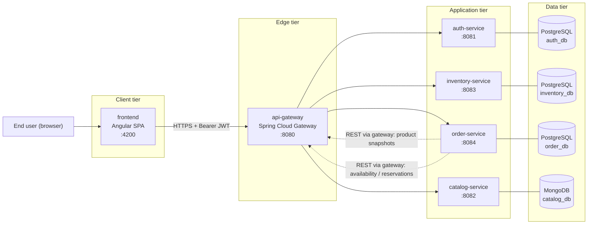
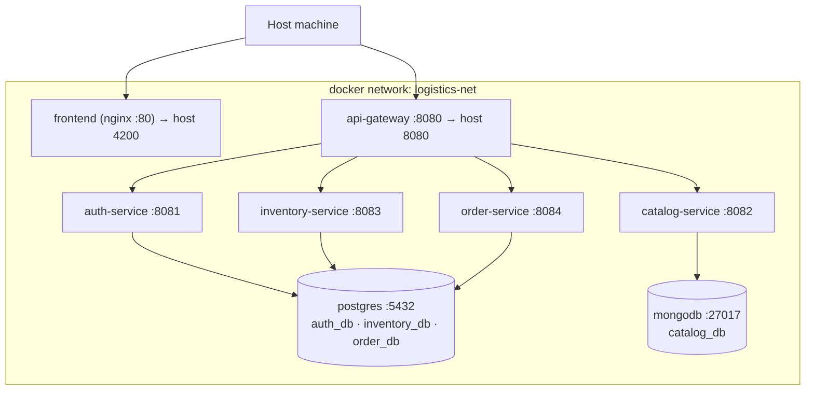
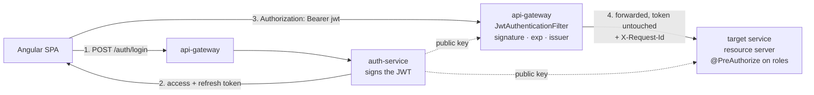
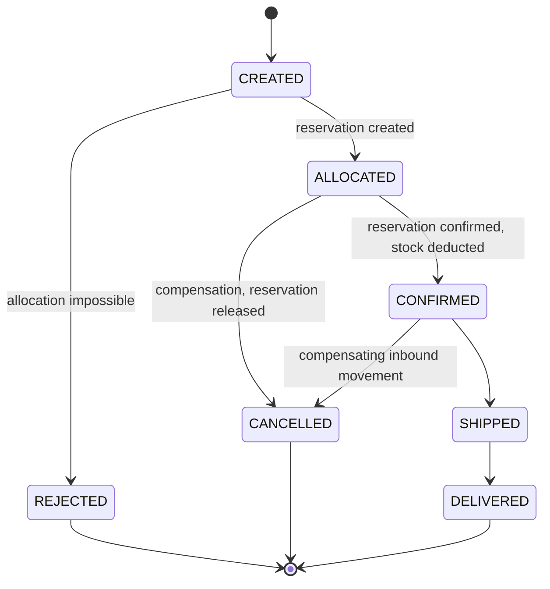

# 01 — Architecture Overview

> Multi-Warehouse Logistics Platform — Phase 0 (design only, no code yet).

## 1. Purpose and scope

The platform manages a **product catalogue**, **per-warehouse stock** and **customer orders** across several
geographically distributed warehouses. Its functional core is not CRUD but the **warehouse allocation
engine**: when an order is placed, the system decides *which warehouse — or combination of warehouses —
fulfils it*.

Quality goals, in priority order:

| # | Goal | How it is addressed |
|---|------|---------------------|
| 1 | Explicit service boundaries | One bounded context per service, one database per service, no shared tables |
| 2 | Testable business rule | Allocation isolated behind `WarehouseAllocationStrategy`; the algorithm performs no I/O |
| 3 | Correct stock under concurrency | Reservation protocol + optimistic locking + orchestration saga |
| 4 | Uniform security | Stateless JWT, validated at the edge **and** inside every service (defence in depth) |
| 5 | Reproducible environment | Docker Compose, externalised configuration, no secret in source |

## 2. Context diagram

**Reading the diagram.** Solid arrows are user-initiated traffic. Dotted arrows are service-to-service
traffic: `order-service` is the only service that calls others, and it does so **through the gateway**, so
routing, tracing and authorisation stay concentrated in one place. `auth-service`, `catalog-service` and
`inventory-service` never call each other — the dependency graph is a tree, not a mesh, which keeps failure
analysis tractable.

## 3. Runtime / deployment view (Docker Compose)

Only the gateway and the frontend publish ports on the host. Application services are reachable only from
inside the Docker network — but they still validate the JWT themselves, because *network isolation is a
deployment detail, not a security guarantee*.

**Note on database containers.** In production each service would own its own database *instance*. Here a
single PostgreSQL container hosts three **separate logical databases** (`auth_db`, `inventory_db`,
`order_db`), created by an init script, each with **its own dedicated user**. No service can read another
service's schema, so the rule "no cross-service SQL join, ever" is enforced by permissions rather than by
discipline. This is a deliberate laptop-scale compromise and it is worth stating as such in an interview.

## 4. Service boundaries — why these seams

The decomposition follows **bounded contexts**: each service owns a set of business concepts that change
together, for the same reason, driven by the same stakeholders.

| Service | Owns (single source of truth) | Changes when… | Would break if merged with |
|---|---|---|---|
| `auth-service` | Identity, credentials, roles, token issuance | Security policy changes | Anything — it is the trust anchor and must be independently auditable |
| `catalog-service` | Product definitions, categories, technical sheets, list prices | Product management changes | `inventory-service`: a product *description* and a product *quantity* have different owners, lifecycles and read/write ratios |
| `inventory-service` | Warehouses, stock levels, movements, reservations | Logistics operations change | `order-service`: stock is consumed by many processes (returns, transfers, stock counts), not only by orders |
| `order-service` | Orders, order lines, allocation decisions, order lifecycle | Commercial rules change | `inventory-service`: merging would hide the interesting distributed-consistency problem behind a local transaction |
| `api-gateway` | Routing, edge authentication, cross-cutting filters | Topology or edge policy changes | — |

Three checks that justify the seams:

1. **Independent write models.** A stock update (`inventory`) and a product-description update (`catalog`)
   are never part of the same business transaction.
2. **Different scaling and access profiles.** The catalogue is read-dominated and cacheable; inventory is
   write-heavy and contention-prone; auth is low-volume but security-critical.
3. **Different data shapes.** Only the catalogue needs a schemaless model (see §5).

**Deliberate coupling, made explicit.** `order-service` depends on the other two at write time. That
dependency is not hidden: it goes through two dedicated ports (`CatalogClient`, `InventoryClient`)
implemented as an **anti-corruption layer** — foreign JSON is translated into local domain objects
immediately, so a change in another service's payload cannot leak into the order domain.

**Referential integrity across services.** `inventory.stock_items.product_id` and
`orders.order_lines.product_id` are `VARCHAR` **logical references**, not foreign keys. There is no
database-level integrity between services — by design. Validity is enforced at the application boundary
(`order-service` resolves products through `catalog-service` before persisting), and orders keep a
**denormalised snapshot** (SKU, name, unit price) so a past order stays readable and commercially accurate
even if the product is later renamed, repriced or discontinued.

## 5. Polyglot persistence — why MongoDB only for the catalogue

The rule applied: **choose the store from the shape of the data and the shape of the queries**, not from
taste.

**PostgreSQL for `auth`, `inventory`, `order`** — these three contexts are relational and transactional:

- Stable, narrow schemas with meaningful relations (`order → order_lines → allocations`).
- Invariants that must hold at write time: `quantity_reserved <= quantity_on_hand`, `quantity_on_hand >= 0`.
  These are expressible as `CHECK` constraints and enforced by the engine, not by application code.
- Multi-row atomic updates inside one aggregate (reserving N lines across M stock items) require real ACID
  transactions.
- **Optimistic locking** (`@Version` / a `version` column) serialises concurrent stock updates.

**MongoDB for `catalog`** — the product sheet is the one genuinely heterogeneous object in the platform:

- A *technical sheet* has different attributes per category: a pallet truck has `capacityKg` and
  `forkLengthMm`; a cardboard box has `flute` and `burstStrengthKpa`. Modelling this relationally leads to
  either one wide sparse table, or an EAV (entity–attribute–value) anti-pattern, or one table per category.
  A document with a nested `attributes` object models it directly.
- Categories carry their own `attributeSchema`, so **the schema is data**: adding a category must not require
  a database migration.
- Access pattern: read the whole product by id or by filter and render it as-is. No join is needed — the
  aggregate *is* the document. Read-dominated, so denormalising the category label into the product is cheap.
- Product data has no cross-entity transactional invariant, which is precisely what MongoDB does *not* offer
  cheaply and what PostgreSQL does.

**The honest counter-argument** (better stated by you than by the interviewer): PostgreSQL `JSONB` with a GIN
index would also handle variable attributes. MongoDB is chosen because the catalogue is the *only* context
where the document is the aggregate, and because operating a second store is part of the exercise. What
would be indefensible is the opposite choice: putting stock or orders in MongoDB and losing the transactional
guarantees the allocation engine depends on.

## 6. Security model

- **Stateless authentication.** The access token is a short-lived JWT (15 min). The refresh token is
  long-lived (7 days), stored **hashed** in `auth_db`, revocable, and rotated on every use.
- **Two levels of enforcement.** The gateway rejects anything without a valid token (coarse-grained:
  *authentication*). Each service re-validates the signature and applies `@PreAuthorize` on roles and on
  ownership (fine-grained: *authorisation*). A service never trusts a header it did not verify itself.
- **Roles**: `ROLE_ADMIN`, `ROLE_WAREHOUSE_MANAGER`, `ROLE_CLIENT`, and `ROLE_SERVICE` for the technical
  accounts used in service-to-service calls.
- **No secret in source.** Keys and passwords come from environment variables (`.env`, git-ignored), with a
  committed `.env.example` documenting every required variable. `application.yml` only ever references
  `${VARIABLE}` placeholders.
- **Passwords** hashed with BCrypt (strength 12). Login failures return a single generic message — no user
  enumeration.

## 7. Consistency: the reservation saga

Creating an order spans two services and cannot use a single database transaction. The pattern applied is an
**orchestration saga** in which `order-service` is the orchestrator, while a **two-phase reservation** inside
`inventory-service` provides the atomic step.

Why a reservation rather than a direct decrement:

- Between "read availability" and "decrement", another order can consume the same stock. The reservation is
  a single atomic operation (`quantity_reserved += q`, guarded by
  `CHECK (quantity_reserved <= quantity_on_hand)` and by optimistic locking) that either succeeds for **all**
  lines or fails for all of them.
- It provides a natural **compensating action** (`cancel`), which is what makes the saga recoverable.
- Reservations carry a TTL, and a scheduled job expires stale ones, so a crash between *reserve* and
  *confirm* cannot leak stock permanently.
- The `reference` field (the order number) makes the call **idempotent**: replaying it returns the existing
  reservation instead of reserving twice.

## 8. Cross-cutting concerns

| Concern | Decision |
|---|---|
| Error format | RFC 7807 `application/problem+json`, produced by one `@RestControllerAdvice` per service |
| Validation | Bean Validation (`@Valid`) on every request DTO; violations mapped to a 400 problem with a per-field `errors` array |
| Correlation | The gateway generates `X-Request-Id` when absent; every service puts it in the SLF4J MDC and echoes it in the error body |
| Logging | Structured JSON logs on stdout (container-friendly); tokens and password fields are never logged |
| Health | Actuator `/actuator/health` with readiness/liveness groups, used as the Docker Compose healthcheck |
| API documentation | springdoc-openapi per service, aggregated behind the gateway |
| Resilience | Timeouts (connect 2 s / read 5 s) on every outbound call, plus a bounded retry on idempotent calls only |
| Time | All timestamps stored as `TIMESTAMPTZ` / UTC `Instant`; formatting is the frontend's job |

## 9. Decision log

| ID | Decision | Rationale | Rejected alternative |
|----|----------|-----------|----------------------|
| D1 | One logical database per service | Enforces the boundary at permission level | Shared schema — cheaper, but destroys service autonomy |
| D2 | JWT validated at the gateway *and* in each service | Defence in depth; services stay safe if exposed | Trusting gateway-injected identity headers |
| D3 | Two-phase reservation + saga | The only way to keep stock correct across two services | Direct decrement (lost updates) or 2PC (heavy, poorly supported) |
| D4 | Denormalised product snapshot in `order_lines` | Historical accuracy; order reads independent of the catalogue | Live lookup on every order read — chatty and historically wrong |
| D5 | RFC 7807 error format | Standard, native in Spring Boot 3, no bespoke envelope | Custom `{code, message}` envelope |
| D6 | Haversine distance from stored coordinates | Deterministic and testable, no external dependency | Road-distance API — realistic but non-deterministic in tests |
| D7 | Explicit `PagedResponse<T>` DTO | Spring's `PageImpl` JSON shape is unstable across versions | Serialising `Page` directly |
| D8 | **RS256 + JWKS** for JWT signing | Only `auth-service` holds the private key; compromising any other service cannot forge a token | HS256 shared secret — simpler, but every service could mint admin tokens |
| D9 | **Technical account (`ROLE_SERVICE`)** for service-to-service calls | Internal endpoints (`/inventory/reservations`, `/products/batch`) stay unreachable from a browser session | Propagating the end-user JWT — would force internal endpoints to accept `ROLE_CLIENT` |
| D10 | **No shared Maven module** | Full service autonomy; no release coupling between services | A `shared-kernel` module — less duplication, but a rebuild of all services on every change |
| D11 | **Pessimistic locking** (`SELECT … FOR UPDATE`, rows ordered by id) on the reservation path | Stock is a highly contended resource; ordering the locks removes deadlocks and avoids a retry storm at the exact moment stock runs out | Optimistic locking + retry — better throughput at low contention, worst behaviour precisely when it matters |

## 10. Design patterns used (and why)

| Pattern | Where | Why |
|---|---|---|
| **Strategy** | `WarehouseAllocationStrategy`, `DistanceCalculator` | The allocation rule is the part most likely to change; interchangeable implementations, each unit-testable in isolation |
| **Template Method** | `AbstractAllocationStrategy` | Both strategies share the same skeleton (filter → full coverage → split) and differ only in how candidates are ordered |
| **Registry / Factory** | `AllocationStrategyResolver` | Selects an implementation by name at runtime (config default, overridable per request) without `if/else` chains — Open/Closed |
| **Saga (orchestration)** | `OrderCreationService` | Distributed consistency with explicit compensating actions |
| **Anti-corruption layer / Adapter** | `CatalogClient`, `InventoryClient` | Foreign payloads never reach the domain model |
| **Repository** | Spring Data interfaces | Persistence abstraction over the domain |
| **DTO + Mapper** | `dto` package + MapStruct | No JPA entity ever crosses the controller boundary |
| **Facade** | `*Service` interfaces | A use-case-level API over repositories and clients |
| **Chain of Responsibility** | Gateway filters | The native Spring Cloud Gateway model: auth → correlation id → routing |
| **Builder** | Domain and DTO construction | Readable construction of objects with many fields |

> SOLID note: the allocation engine is the deliberate showcase of **Open/Closed** and **Dependency
> Inversion** — `OrderCreationService` depends on the `WarehouseAllocationStrategy` abstraction, and a third
> strategy can be added without modifying a single existing class.
