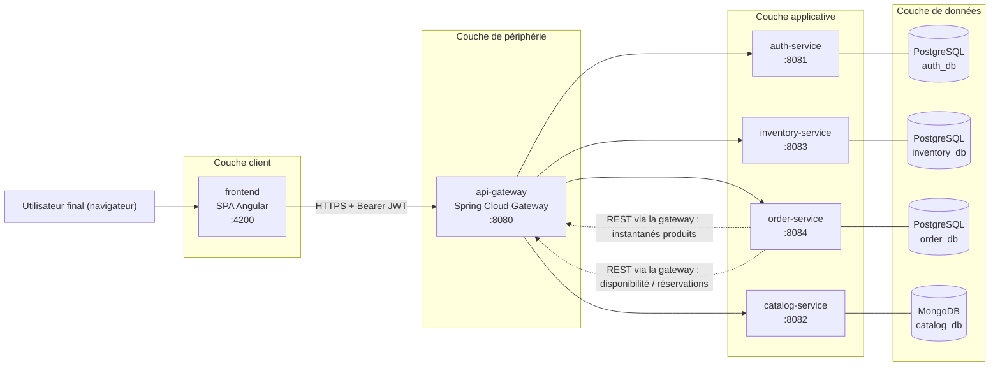
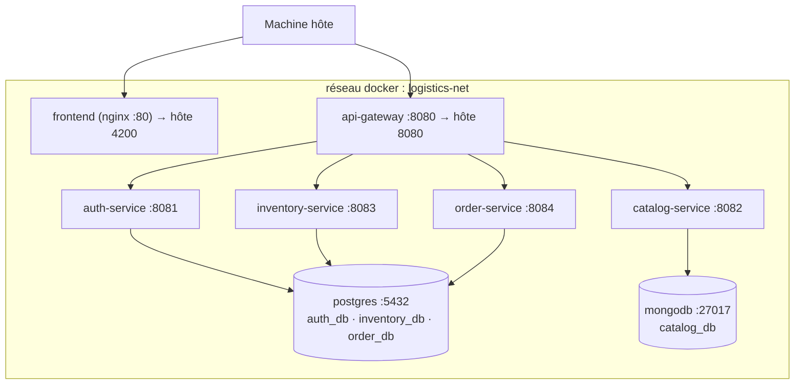
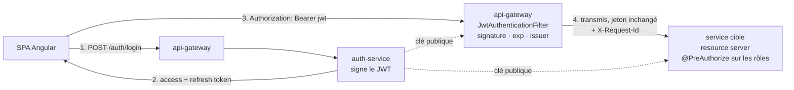

# 01 — Vue d'ensemble de l'architecture

> Plateforme Microservices de Gestion Logistique — Phase 0 (conception seule, aucun code à ce stade).

## 1. Objet et périmètre

La plateforme gère un **catalogue de produits**, un **stock par entrepôt** et des **commandes clients**
répartis sur plusieurs entrepôts géographiquement distants. Son cœur fonctionnel n'est pas du CRUD mais le
**moteur d'affectation aux entrepôts** : lorsqu'une commande est passée, le système décide *quel entrepôt —
ou quelle combinaison d'entrepôts — la satisfait*.

Objectifs de qualité, par ordre de priorité :

| # | Objectif | Comment il est traité |
|---|------|---------------------|
| 1 | Frontières de services explicites | Un bounded context par service, une base par service, aucune table partagée |
| 2 | Règle métier testable | Affectation isolée derrière `WarehouseAllocationStrategy` ; l'algorithme ne fait aucune E/S |
| 3 | Stock correct en concurrence | Protocole de réservation + verrouillage + saga d'orchestration |
| 4 | Sécurité uniforme | JWT sans état, validé en périphérie **et** dans chaque service (défense en profondeur) |
| 5 | Environnement reproductible | Docker Compose, configuration externalisée, aucun secret dans les sources |

## 2. Diagramme de contexte

**Lecture du diagramme.** Les flèches pleines représentent le trafic initié par l'utilisateur. Les flèches
pointillées représentent le trafic entre services : `order-service` est le seul service qui en appelle
d'autres, et il le fait **à travers la gateway**, de sorte que le routage, la traçabilité et l'autorisation
restent concentrés en un seul endroit. `auth-service`, `catalog-service` et `inventory-service` ne s'appellent
jamais entre eux — le graphe de dépendances est un arbre, pas un maillage, ce qui garde l'analyse de panne
traitable.

## 3. Vue d'exécution / de déploiement (Docker Compose)

Seuls la gateway et le frontend publient des ports sur l'hôte. Les services applicatifs ne sont joignables
que depuis l'intérieur du réseau Docker — mais ils valident malgré tout le JWT eux-mêmes, car *l'isolation
réseau est un détail de déploiement, pas une garantie de sécurité*.

**Note sur les conteneurs de bases de données.** En production, chaque service posséderait sa propre
*instance* de base. Ici, un unique conteneur PostgreSQL héberge trois **bases logiques distinctes**
(`auth_db`, `inventory_db`, `order_db`), créées par un script d'initialisation, chacune avec **son propre
utilisateur dédié**. Aucun service ne peut lire le schéma d'un autre : la règle « aucune jointure SQL
inter-services, jamais » est donc appliquée par les permissions plutôt que par la discipline. C'est un
compromis assumé à l'échelle d'un poste de développement, et il vaut mieux le présenter comme tel en
entretien.

## 4. Frontières des services — pourquoi ces découpes

La décomposition suit les **bounded contexts** : chaque service possède un ensemble de concepts métier qui
évoluent ensemble, pour la même raison, sous l'impulsion des mêmes acteurs.

| Service | Possède (source unique de vérité) | Change lorsque… | Casserait s'il était fusionné avec |
|---|---|---|---|
| `auth-service` | Identités, identifiants, rôles, émission des jetons | La politique de sécurité change | N'importe lequel — c'est l'ancre de confiance, elle doit rester auditable indépendamment |
| `catalog-service` | Définitions produits, catégories, fiches techniques, prix catalogue | La gestion produit change | `inventory-service` : la *description* d'un produit et sa *quantité* n'ont ni le même propriétaire, ni le même cycle de vie, ni le même ratio lecture/écriture |
| `inventory-service` | Entrepôts, niveaux de stock, mouvements, réservations | Les opérations logistiques changent | `order-service` : le stock est consommé par de nombreux processus (retours, transferts, inventaires), pas seulement par les commandes |
| `order-service` | Commandes, lignes, décisions d'affectation, cycle de vie | Les règles commerciales changent | `inventory-service` : la fusion masquerait derrière une transaction locale le problème intéressant de cohérence distribuée |
| `api-gateway` | Routage, authentification en périphérie, filtres transverses | La topologie ou la politique de périphérie change | — |

Trois contrôles qui justifient ces découpes :

1. **Modèles d'écriture indépendants.** Une mise à jour de stock (`inventory`) et une mise à jour de
   description produit (`catalog`) ne font jamais partie de la même transaction métier.
2. **Profils de charge et d'accès différents.** Le catalogue est dominé par la lecture et cacheable ;
   l'inventaire est intensif en écriture et sujet à la contention ; l'authentification est peu volumineuse
   mais critique pour la sécurité.
3. **Formes de données différentes.** Seul le catalogue a besoin d'un modèle sans schéma (voir §5).

**Un couplage délibéré, rendu explicite.** `order-service` dépend des deux autres au moment de l'écriture.
Cette dépendance n'est pas dissimulée : elle passe par deux ports dédiés (`CatalogClient`, `InventoryClient`)
implémentés comme une **couche anticorruption** — le JSON étranger est traduit immédiatement en objets du
domaine local, de sorte qu'un changement dans la charge utile d'un autre service ne peut pas s'infiltrer dans
le domaine des commandes.

**Intégrité référentielle entre services.** `inventory.stock_items.product_id` et
`orders.order_lines.product_id` sont des **références logiques** `VARCHAR`, pas des clés étrangères. Il
n'existe aucune intégrité au niveau base entre services — c'est voulu. La validité est garantie à la
frontière applicative (`order-service` résout les produits auprès de `catalog-service` avant de persister),
et les commandes conservent un **instantané dénormalisé** (SKU, nom, prix unitaire) afin qu'une commande
passée reste lisible et commercialement exacte même si le produit est ensuite renommé, retarifé ou retiré.

## 5. Persistance polyglotte — pourquoi MongoDB uniquement pour le catalogue

La règle appliquée : **choisir le magasin de données d'après la forme des données et la forme des
requêtes**, non par goût.

**PostgreSQL pour `auth`, `inventory`, `order`** — ces trois contextes sont relationnels et transactionnels :

- Des schémas stables et resserrés, avec des relations qui ont un sens (`order → order_lines → allocations`).
- Des invariants qui doivent tenir au moment de l'écriture : `quantity_reserved <= quantity_on_hand`,
  `quantity_on_hand >= 0`. Ils s'expriment comme contraintes `CHECK` et sont appliqués par le moteur, pas par
  du code applicatif.
- Les mises à jour atomiques multi-lignes au sein d'un même agrégat (réserver N lignes sur M articles de
  stock) exigent de vraies transactions ACID.
- Le **verrouillage optimiste** (`@Version` / une colonne `version`) sérialise les mises à jour de stock
  concurrentes.

**MongoDB pour `catalog`** — la fiche produit est le seul objet réellement hétérogène de la plateforme :

- Une *fiche technique* n'a pas les mêmes attributs selon la catégorie : un transpalette a `capacityKg` et
  `forkLengthMm` ; un carton a `flute` et `burstStrengthKpa`. Modéliser cela en relationnel conduit soit à
  une table large et creuse, soit à un antipatron EAV (entité–attribut–valeur), soit à une table par
  catégorie. Un document avec un objet `attributes` imbriqué le modélise directement.
- Les catégories portent leur propre `attributeSchema` : **le schéma est une donnée**, et ajouter une
  catégorie ne doit pas exiger une migration de base.
- Motif d'accès : lire le produit entier par identifiant ou par filtre, et l'afficher tel quel. Aucune
  jointure n'est nécessaire — l'agrégat *est* le document. La lecture domine, donc dénormaliser le libellé de
  catégorie dans le produit coûte peu.
- Les données produit ne portent aucun invariant transactionnel inter-entités, ce qui est précisément ce que
  MongoDB n'offre *pas* à bon compte et ce que PostgreSQL offre.

**Le contre-argument honnête** (mieux vaut l'énoncer soi-même que le voir arriver de l'examinateur) :
PostgreSQL `JSONB` avec un index GIN traiterait aussi des attributs variables. MongoDB est retenu parce que
le catalogue est le *seul* contexte où le document est l'agrégat, et parce qu'exploiter un second magasin de
données fait partie de l'exercice. Ce qui serait indéfendable, c'est le choix inverse : mettre le stock ou
les commandes dans MongoDB et perdre les garanties transactionnelles dont dépend le moteur d'affectation.

## 6. Modèle de sécurité

- **Authentification sans état.** L'access token est un JWT de courte durée (15 min). Le refresh token est de
  longue durée (7 jours), stocké **haché** dans `auth_db`, révocable, et renouvelé à chaque usage.
- **Deux niveaux d'application.** La gateway rejette tout ce qui n'a pas de jeton valide (grain grossier :
  *authentification*). Chaque service revalide la signature et applique `@PreAuthorize` sur les rôles et sur
  la propriété de la ressource (grain fin : *autorisation*). Un service ne fait jamais confiance à un en-tête
  qu'il n'a pas vérifié lui-même.
- **Rôles** : `ROLE_ADMIN`, `ROLE_WAREHOUSE_MANAGER`, `ROLE_CLIENT`, et `ROLE_SERVICE` pour les comptes
  techniques utilisés dans les appels entre services.
- **Aucun secret dans les sources.** Les clés et les mots de passe proviennent de variables d'environnement
  (`.env`, ignoré par Git), avec un `.env.example` versionné documentant chaque variable requise.
  `application.yml` ne référence jamais que des substituants `${VARIABLE}`.
- **Mots de passe** hachés avec BCrypt (force 12). Les échecs de connexion renvoient un message générique
  unique — aucune énumération d'utilisateurs.

## 7. Cohérence : la saga de réservation

Créer une commande traverse deux services et ne peut pas tenir dans une seule transaction de base. Le patron
appliqué est une **saga d'orchestration** dans laquelle `order-service` est l'orchestrateur, tandis qu'une
**réservation en deux temps** au sein d'`inventory-service` fournit l'étape atomique.

Pourquoi une réservation plutôt qu'un décrément direct :

- Entre « lire la disponibilité » et « décrémenter », une autre commande peut consommer le même stock. La
  réservation est une opération atomique unique (`quantity_reserved += q`, protégée par
  `CHECK (quantity_reserved <= quantity_on_hand)` et par le verrouillage) qui réussit pour **toutes** les
  lignes ou échoue pour toutes.
- Elle fournit une **action compensatoire** naturelle (`cancel`), qui est ce qui rend la saga réversible.
- Les réservations portent un TTL, et une tâche planifiée expire celles qui traînent : un plantage entre
  *réserver* et *confirmer* ne peut pas immobiliser du stock définitivement.
- Le champ `reference` (le numéro de commande) rend l'appel **idempotent** : le rejouer renvoie la
  réservation existante au lieu de réserver deux fois.

## 8. Préoccupations transverses

| Préoccupation | Décision |
|---|---|
| Format d'erreur | RFC 7807 `application/problem+json`, produit par un `@RestControllerAdvice` par service |
| Validation | Bean Validation (`@Valid`) sur chaque DTO de requête ; les violations sont converties en problème 400 avec un tableau `errors` par champ |
| Corrélation | La gateway génère `X-Request-Id` s'il est absent ; chaque service le place dans le MDC SLF4J et le renvoie dans le corps d'erreur |
| Journalisation | Journaux structurés JSON sur stdout (adaptés aux conteneurs) ; les jetons et les champs de mot de passe ne sont jamais journalisés |
| Santé | Actuator `/actuator/health` avec les groupes readiness/liveness, utilisé comme healthcheck Docker Compose |
| Documentation d'API | springdoc-openapi par service, agrégée derrière la gateway |
| Résilience | Timeouts (connexion 2 s / lecture 5 s) sur chaque appel sortant, plus une reprise bornée sur les seuls appels idempotents |
| Temps | Tous les horodatages stockés en `TIMESTAMPTZ` / `Instant` UTC ; le formatage est l'affaire du frontend |

## 9. Journal des décisions

| ID | Décision | Justification | Alternative écartée |
|----|----------|-----------|----------------------|
| D1 | Une base logique par service | Applique la frontière au niveau des permissions | Schéma partagé — moins coûteux, mais détruit l'autonomie des services |
| D2 | JWT validé à la gateway *et* dans chaque service | Défense en profondeur ; les services restent sûrs s'ils sont exposés | Faire confiance aux en-têtes d'identité injectés par la gateway |
| D3 | Réservation en deux temps + saga | Le seul moyen de garder le stock correct entre deux services | Décrément direct (mises à jour perdues) ou 2PC (lourd, mal supporté) |
| D4 | Instantané produit dénormalisé dans `order_lines` | Exactitude historique ; la lecture d'une commande ne dépend pas du catalogue | Résolution à la volée à chaque lecture — bavard et historiquement faux |
| D5 | Format d'erreur RFC 7807 | Standard, natif dans Spring Boot 3, aucune enveloppe maison | Enveloppe `{code, message}` propriétaire |
| D6 | Distance de Haversine à partir des coordonnées stockées | Déterministe et testable, aucune dépendance externe | API de distance routière — réaliste mais non déterministe en test |
| D7 | DTO `PagedResponse<T>` explicite | La forme JSON de `PageImpl` de Spring est instable d'une version à l'autre | Sérialiser `Page` directement |
| D8 | **RS256 + JWKS** pour la signature des JWT | Seul `auth-service` détient la clé privée ; compromettre un autre service ne permet pas de forger un jeton | Secret partagé HS256 — plus simple, mais chaque service pourrait émettre des jetons administrateur |
| D9 | **Compte technique (`ROLE_SERVICE`)** pour les appels entre services | Les endpoints internes (`/inventory/reservations`, `/products/batch`) restent inatteignables depuis une session navigateur | Propager le JWT de l'utilisateur final — obligerait les endpoints internes à accepter `ROLE_CLIENT` |
| D10 | **Aucun module Maven partagé** | Autonomie complète des services ; aucun couplage de livraison entre eux | Un module `shared-kernel` — moins de duplication, mais une reconstruction de tous les services à chaque changement |
| D11 | **Verrouillage pessimiste** (`SELECT … FOR UPDATE`, lignes ordonnées par id) sur le chemin de réservation | Le stock est une ressource fortement disputée ; ordonner les verrous supprime les interblocages et évite une tempête de reprises au moment précis où le stock s'épuise | Verrouillage optimiste + reprise — meilleur débit à faible contention, pire comportement précisément quand cela compte |

## 10. Patrons de conception utilisés (et pourquoi)

| Patron | Où | Pourquoi |
|---|---|---|
| **Strategy** | `WarehouseAllocationStrategy`, `DistanceCalculator` | La règle d'affectation est la partie la plus susceptible de changer ; implémentations interchangeables, chacune testable unitairement isolément |
| **Template Method** | `AbstractAllocationStrategy` | Les deux stratégies partagent le même squelette (filtrage → couverture totale → fractionnement) et ne diffèrent que par l'ordonnancement des candidats |
| **Registry / Factory** | `AllocationStrategyResolver` | Sélectionne une implémentation par son nom à l'exécution (valeur par défaut configurable, surchargeable par requête) sans chaîne de `if/else` — principe ouvert/fermé |
| **Saga (orchestration)** | `OrderCreationService` | Cohérence distribuée avec des actions compensatoires explicites |
| **Couche anticorruption / Adapter** | `CatalogClient`, `InventoryClient` | Les charges utiles étrangères n'atteignent jamais le modèle du domaine |
| **Repository** | Interfaces Spring Data | Abstraction de la persistance au-dessus du domaine |
| **DTO + Mapper** | Paquet `dto` + MapStruct | Aucune entité JPA ne franchit jamais la frontière du contrôleur |
| **Facade** | Interfaces `*Service` | Une API de niveau cas d'utilisation au-dessus des repositories et des clients |
| **Chain of Responsibility** | Filtres de la gateway | Le modèle natif de Spring Cloud Gateway : authentification → identifiant de corrélation → routage |
| **Builder** | Construction des objets du domaine et des DTO | Construction lisible d'objets à nombreux champs |

> Note SOLID : le moteur d'affectation est la vitrine délibérée des principes **ouvert/fermé** et
> **d'inversion des dépendances** — `OrderCreationService` dépend de l'abstraction
> `WarehouseAllocationStrategy`, et une troisième stratégie peut être ajoutée sans modifier une seule classe
> existante.
