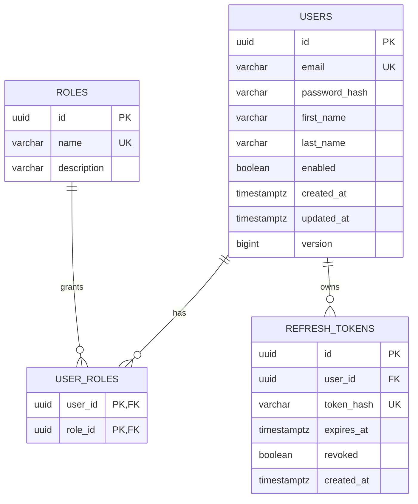
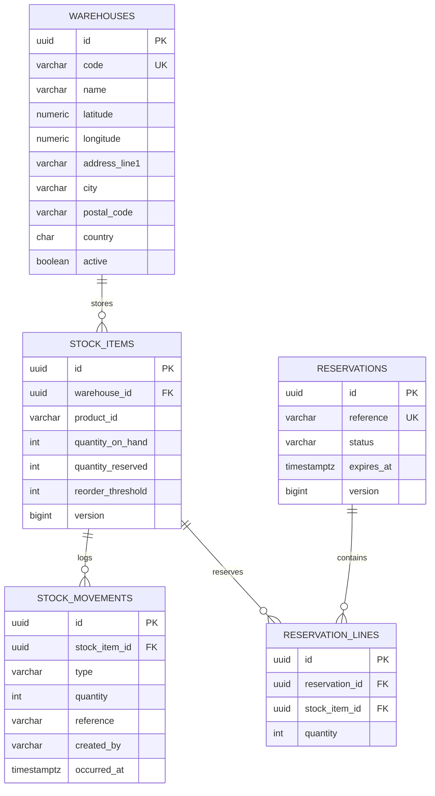
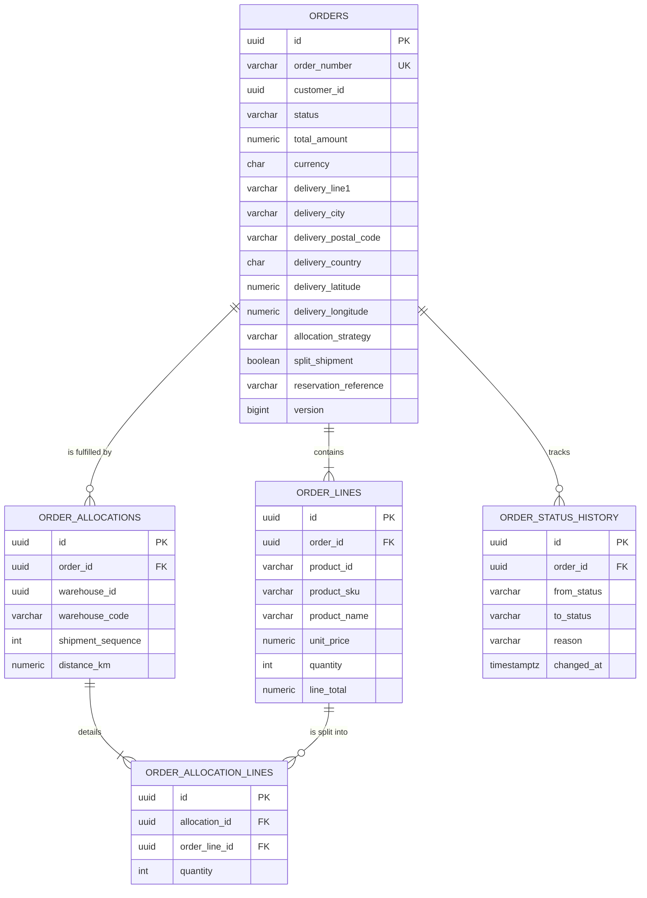

# 02 — Data Model per Service

Conventions applied everywhere:

- Primary keys are **UUID v4**, generated by the application (`UUID.randomUUID()`), not by the database.
  Rationale: an id exists before the insert, which matters when an order and its lines are built in memory,
  and ids are safe to expose across service boundaries.
- Every mutable table carries `created_at TIMESTAMPTZ NOT NULL`, `updated_at TIMESTAMPTZ NOT NULL`
  (Spring Data auditing) and, when concurrently updated, `version BIGINT` for **optimistic locking**.
- Money is `NUMERIC(12,2)` plus an ISO-4217 `currency VARCHAR(3)` — never a floating-point type.
- Cross-service references (`product_id`, `warehouse_id`, `customer_id`) are plain `VARCHAR(36)`/`UUID`
  columns **without foreign keys**: they point outside the database on purpose (see 01-architecture §4).
- Schema is created and versioned by **Flyway** migrations (`V1__init.sql`, …); `spring.jpa.hibernate.ddl-auto`
  is `validate` in every profile, never `update`.

---

## 1. auth-service — PostgreSQL (`auth_db`, schema `auth`)



### `users`

| Column | Type | Constraints | Notes |
|---|---|---|---|
| `id` | `UUID` | PK | Becomes the JWT `sub` claim |
| `email` | `VARCHAR(180)` | `NOT NULL`, `UNIQUE` (lower-cased before persisting) | Login identifier |
| `password_hash` | `VARCHAR(72)` | `NOT NULL` | BCrypt, strength 12. Never returned by any endpoint |
| `first_name` | `VARCHAR(80)` | `NOT NULL` | |
| `last_name` | `VARCHAR(80)` | `NOT NULL` | |
| `enabled` | `BOOLEAN` | `NOT NULL DEFAULT TRUE` | Soft deactivation; disabled users cannot obtain a token |
| `created_at` / `updated_at` | `TIMESTAMPTZ` | `NOT NULL` | Auditing |
| `version` | `BIGINT` | `NOT NULL DEFAULT 0` | Optimistic locking |

Index: `ux_users_email` unique on `lower(email)`.

### `roles`

| Column | Type | Constraints |
|---|---|---|
| `id` | `UUID` | PK |
| `name` | `VARCHAR(40)` | `NOT NULL`, `UNIQUE` |
| `description` | `VARCHAR(160)` | |

Seeded values: `ROLE_ADMIN`, `ROLE_WAREHOUSE_MANAGER`, `ROLE_CLIENT`, `ROLE_SERVICE`.

> Roles live in a table rather than in a Java enum column so that granting a role is a data operation, not a
> deployment. `ROLE_SERVICE` is reserved for technical accounts and can never be self-assigned at
> registration — the register endpoint hard-codes `ROLE_CLIENT`.

### `user_roles`

Join table, composite PK `(user_id, role_id)`, both FKs `ON DELETE CASCADE`. Many-to-many: a warehouse
manager can also be an admin.

### `refresh_tokens`

| Column | Type | Constraints | Notes |
|---|---|---|---|
| `id` | `UUID` | PK | |
| `user_id` | `UUID` | FK → `users(id)`, `NOT NULL` | |
| `token_hash` | `VARCHAR(64)` | `NOT NULL`, `UNIQUE` | SHA-256 of the opaque token. A database leak must not yield usable tokens |
| `expires_at` | `TIMESTAMPTZ` | `NOT NULL` | |
| `revoked` | `BOOLEAN` | `NOT NULL DEFAULT FALSE` | Set on logout and on rotation |
| `created_at` | `TIMESTAMPTZ` | `NOT NULL` | |

Index: `ix_refresh_tokens_user_id`. A scheduled job deletes expired rows.

---

## 2. catalog-service — MongoDB (`catalog_db`)

Two collections. Ids are stored as `String` (UUID) rather than `ObjectId`, so that a product id looks the
same in every service and in every URL.

### Collection `products`

```json
{
  "_id": "8f2b0c3a-...-a91e",
  "sku": "PAL-TRK-2500",
  "name": "Pallet truck 2500 kg",
  "description": "Manual pallet truck, reinforced forks.",
  "brand": "Logimove",
  "categoryId": "c1a4...-77bd",
  "categoryPath": "handling/pallet-trucks",
  "price": { "amount": 349.90, "currency": "EUR" },
  "attributes": {
    "capacityKg": "2500",
    "forkLengthMm": "1150",
    "wheelMaterial": "polyurethane"
  },
  "dimensions": { "lengthMm": 1550, "widthMm": 685, "heightMm": 1230, "weightG": 78000 },
  "images": ["https://cdn.example/pal-trk-2500.jpg"],
  "status": "ACTIVE",
  "createdAt": "2026-01-14T09:12:03Z",
  "updatedAt": "2026-02-02T15:40:11Z",
  "version": 3
}
```

| Field | Type | Constraints | Notes |
|---|---|---|---|
| `_id` | `String` (UUID) | PK | Exposed as `id` in the API |
| `sku` | `String` | required, unique index, `^[A-Z0-9-]{3,32}$` | Human-readable business key |
| `name` | `String` | required, 3–160 chars | Text-indexed |
| `description` | `String` | max 4000 chars | Text-indexed |
| `brand` | `String` | optional | |
| `categoryId` | `String` (UUID) | required, must exist | Logical reference *inside* the same database |
| `categoryPath` | `String` | derived | Denormalised from the category, for breadcrumb display without a second query |
| `price.amount` | `Decimal128` | required, `> 0` | `Decimal128`, never `Double` |
| `price.currency` | `String` | required, ISO-4217 | |
| `attributes` | `Map<String,String>` | free-form | **The reason MongoDB is used here**; validated against the category `attributeSchema` |
| `dimensions` | embedded document | optional | Used later for shipment volume |
| `images` | `String[]` | optional | URLs only, no binary in the database |
| `status` | `String` enum | `ACTIVE` / `DISCONTINUED` | Deletion is soft — an order may reference the product |
| `createdAt` / `updatedAt` | `Instant` | auditing | |
| `version` | `Long` | `@Version` | Optimistic locking (supported by Spring Data MongoDB) |

Indexes: `sku` (unique), `categoryId`, `status`, compound `{status: 1, categoryId: 1}` for the listing
screen, and a text index on `{name, description, brand}` for search.

### Collection `categories`

```json
{
  "_id": "c1a4...-77bd",
  "name": "Pallet trucks",
  "slug": "pallet-trucks",
  "parentId": "b70f...-1c02",
  "path": "handling/pallet-trucks",
  "attributeSchema": [
    { "key": "capacityKg",   "label": "Capacity (kg)",    "type": "NUMBER",  "required": true  },
    { "key": "forkLengthMm", "label": "Fork length (mm)", "type": "NUMBER",  "required": true  },
    { "key": "wheelMaterial","label": "Wheel material",   "type": "STRING",  "required": false }
  ],
  "createdAt": "2026-01-10T08:00:00Z",
  "updatedAt": "2026-01-10T08:00:00Z"
}
```

| Field | Type | Notes |
|---|---|---|
| `_id` | `String` (UUID) | PK |
| `name` | `String` | required |
| `slug` | `String` | required, unique |
| `parentId` | `String` | nullable → root category |
| `path` | `String` | **Materialised path** (`handling/pallet-trucks`): the whole ancestor chain in one field, so a subtree is fetched with one prefix query instead of a recursive traversal |
| `attributeSchema` | array of `{key, label, type, required}` | Declares which technical attributes a product of this category must carry; `type ∈ {STRING, NUMBER, BOOLEAN}` |

Indexes: `slug` (unique), `parentId`, `path`.

> The hierarchy uses a materialised path rather than pure parent references because the dominant query is
> "everything under this branch", and because category trees are shallow and rarely restructured.

---

## 3. inventory-service — PostgreSQL (`inventory_db`, schema `inventory`)



### `warehouses`

| Column | Type | Constraints | Notes |
|---|---|---|---|
| `id` | `UUID` | PK | |
| `code` | `VARCHAR(16)` | `NOT NULL`, `UNIQUE` | e.g. `WH-CASA-01`; used in order allocations for readability |
| `name` | `VARCHAR(120)` | `NOT NULL` | |
| `latitude` | `NUMERIC(9,6)` | `NOT NULL`, `CHECK BETWEEN -90 AND 90` | Input to the distance calculation |
| `longitude` | `NUMERIC(9,6)` | `NOT NULL`, `CHECK BETWEEN -180 AND 180` | |
| `address_line1` | `VARCHAR(180)` | `NOT NULL` | |
| `city` | `VARCHAR(80)` | `NOT NULL` | |
| `postal_code` | `VARCHAR(16)` | `NOT NULL` | |
| `country` | `VARCHAR(2)` | `NOT NULL` | ISO-3166-1 alpha-2. Not `CHAR(2)`: CHAR pads with spaces, so a value read back as `'MA '` would not equal the `'MA'` written |
| `active` | `BOOLEAN` | `NOT NULL DEFAULT TRUE` | An inactive warehouse is excluded from allocation but keeps its history |
| `created_at` / `updated_at` | `TIMESTAMPTZ` | `NOT NULL` | |

`NUMERIC(9,6)` gives ~11 cm of precision — far beyond what warehouse-level distance ranking needs, and exact,
unlike a floating-point type.

### `stock_items` — the central table

| Column | Type | Constraints | Notes |
|---|---|---|---|
| `id` | `UUID` | PK | |
| `warehouse_id` | `UUID` | FK → `warehouses(id)`, `NOT NULL` | |
| `product_id` | `VARCHAR(36)` | `NOT NULL` | Logical reference to `catalog_db.products._id` — **no FK** |
| `quantity_on_hand` | `INTEGER` | `NOT NULL DEFAULT 0`, `CHECK >= 0` | Physically present |
| `quantity_reserved` | `INTEGER` | `NOT NULL DEFAULT 0`, `CHECK >= 0` | Promised to open reservations |
| `reorder_threshold` | `INTEGER` | `NOT NULL DEFAULT 0`, `CHECK >= 0` | Low-stock alert on the dashboard |
| `version` | `BIGINT` | `NOT NULL DEFAULT 0` | JPA `@Version`; guards the low-contention write paths (see below) |
| `updated_at` | `TIMESTAMPTZ` | `NOT NULL` | |

Constraints and indexes:

- `UNIQUE (warehouse_id, product_id)` — one stock line per product per warehouse.
- `CHECK (quantity_reserved <= quantity_on_hand)` — **the invariant that makes overselling impossible at the
  database level**, whatever the application code does.
- `ix_stock_items_product_id` on `product_id` — the availability query filters on a list of product ids.

**Concurrency control — pessimistic on the reservation path** (decision D11). Creating a reservation opens a
transaction and takes a write lock on every `stock_item` involved with
`SELECT … FOR UPDATE`, **always in ascending `id` order**. Two points to make in an interview:

- Ordering the locks is what removes deadlocks: two concurrent orders touching the same two stock items can
  no longer each hold what the other waits for.
- Pessimistic locking is chosen here *because* stock is contended precisely when it matters. Optimistic
  locking would degrade exactly at the moment the last units are being taken, turning a stockout into a retry
  storm. The `version` column stays and still protects the low-contention paths (`PUT /stock`, manual
  movements), where a lost update is the only real risk.

The `CHECK` constraint is the last line of defence: even if a lock were forgotten, the database refuses to
oversell.

**Available quantity is derived, never stored**: `available = quantity_on_hand - quantity_reserved`. Storing
it would create a third value to keep consistent with the other two.

### `stock_movements` — append-only ledger

| Column | Type | Constraints | Notes |
|---|---|---|---|
| `id` | `UUID` | PK | |
| `stock_item_id` | `UUID` | FK → `stock_items(id)`, `NOT NULL` | |
| `type` | `VARCHAR(20)` | `NOT NULL` | `INBOUND`, `OUTBOUND`, `ADJUSTMENT`, `RESERVATION`, `RELEASE` |
| `quantity` | `INTEGER` | `NOT NULL`, `CHECK <> 0` | Signed: positive increases on-hand, negative decreases it |
| `reference` | `VARCHAR(64)` | | Order number, reservation id or supplier delivery note |
| `created_by` | `VARCHAR(64)` | `NOT NULL` | User id or service name taken from the JWT |
| `occurred_at` | `TIMESTAMPTZ` | `NOT NULL` | |

Rows are **never updated or deleted**. `quantity_on_hand` is the projection of this ledger, which gives a
full audit trail and lets a discrepancy be replayed and explained. Index:
`ix_movements_item_time (stock_item_id, occurred_at DESC)`.

### `reservations` / `reservation_lines`

| Column | Type | Constraints | Notes |
|---|---|---|---|
| `id` | `UUID` | PK | |
| `reference` | `VARCHAR(64)` | `NOT NULL`, `UNIQUE` | The order number. **Uniqueness is the idempotency guarantee**: a retried call cannot reserve twice |
| `status` | `VARCHAR(16)` | `NOT NULL` | `ACTIVE`, `CONFIRMED`, `CANCELLED`, `EXPIRED` |
| `expires_at` | `TIMESTAMPTZ` | `NOT NULL` | TTL, default 5 min; a scheduled job releases stale `ACTIVE` rows |
| `created_at` / `updated_at` | `TIMESTAMPTZ` | `NOT NULL` | |
| `version` | `BIGINT` | `NOT NULL DEFAULT 0` | |

`reservation_lines`: `id` (PK), `reservation_id` (FK, `ON DELETE CASCADE`), `stock_item_id` (FK),
`quantity` (`CHECK > 0`), `UNIQUE (reservation_id, stock_item_id)`.

---

## 4. order-service — PostgreSQL (`order_db`, schema `orders`)



### `orders`

| Column | Type | Constraints | Notes |
|---|---|---|---|
| `id` | `UUID` | PK | |
| `order_number` | `VARCHAR(20)` | `NOT NULL`, `UNIQUE` | `ORD-2026-000123`, generated from a PostgreSQL sequence. Public-facing identifier and reservation reference |
| `customer_id` | `UUID` | `NOT NULL` | JWT `sub`. Never taken from the request body — a client must not be able to order on someone else's behalf |
| `status` | `VARCHAR(16)` | `NOT NULL` | `CREATED`, `ALLOCATED`, `CONFIRMED`, `SHIPPED`, `DELIVERED`, `CANCELLED`, `REJECTED` |
| `total_amount` | `NUMERIC(12,2)` | `NOT NULL`, `CHECK >= 0` | Computed server-side from the snapshot prices; a client-supplied total is ignored |
| `currency` | `VARCHAR(3)` | `NOT NULL` | |
| `delivery_line1` | `VARCHAR(180)` | `NOT NULL` | |
| `delivery_city` | `VARCHAR(80)` | `NOT NULL` | |
| `delivery_postal_code` | `VARCHAR(16)` | `NOT NULL` | |
| `delivery_country` | `VARCHAR(2)` | `NOT NULL` | |
| `delivery_latitude` | `NUMERIC(9,6)` | `NOT NULL` | Input to the allocation algorithm |
| `delivery_longitude` | `NUMERIC(9,6)` | `NOT NULL` | |
| `allocation_strategy` | `VARCHAR(40)` | `NOT NULL` | Name of the strategy that produced the plan — **stored so a past decision can be explained** |
| `split_shipment` | `BOOLEAN` | `NOT NULL` | `true` when more than one warehouse serves the order |
| `reservation_reference` | `VARCHAR(64)` | | Link to the inventory reservation, for compensation |
| `created_at` / `updated_at` | `TIMESTAMPTZ` | `NOT NULL` | |
| `version` | `BIGINT` | `NOT NULL DEFAULT 0` | |

Indexes: `ix_orders_customer_created (customer_id, created_at DESC)` for "my orders",
`ix_orders_status` for the back-office.

The delivery address is mapped as a JPA `@Embeddable` (`DeliveryAddress`) containing a nested `GeoPoint`
value object — one table, but a rich domain model.

### `order_lines`

| Column | Type | Constraints | Notes |
|---|---|---|---|
| `id` | `UUID` | PK | |
| `order_id` | `UUID` | FK → `orders(id)`, `ON DELETE CASCADE`, `NOT NULL` | |
| `product_id` | `VARCHAR(36)` | `NOT NULL` | Logical reference to the catalogue |
| `product_sku` | `VARCHAR(32)` | `NOT NULL` | **Snapshot** |
| `product_name` | `VARCHAR(160)` | `NOT NULL` | **Snapshot** |
| `unit_price` | `NUMERIC(12,2)` | `NOT NULL`, `CHECK > 0` | **Snapshot — the price at order time, never re-read** |
| `quantity` | `INTEGER` | `NOT NULL`, `CHECK > 0` | |
| `line_total` | `NUMERIC(12,2)` | `NOT NULL` | `unit_price * quantity`, stored to keep the total auditable |

`UNIQUE (order_id, product_id)` — the same product cannot appear on two lines; duplicates in the request are
rejected with a 400 rather than silently merged.

### `order_allocations` / `order_allocation_lines` — the algorithm's output, persisted

| Column | Type | Notes |
|---|---|---|
| `order_allocations.warehouse_id` | `UUID` | Logical reference to `inventory_db.warehouses` |
| `order_allocations.warehouse_code` | `VARCHAR(16)` | Snapshot, so the order can be displayed without calling `inventory-service` |
| `order_allocations.shipment_sequence` | `INTEGER` | 1, 2, 3… — one shipment per allocated warehouse |
| `order_allocations.distance_km` | `NUMERIC(8,2)` | Distance used by the decision; kept for traceability |
| `order_allocation_lines.quantity` | `INTEGER` | `CHECK > 0` — how much of that order line this warehouse ships |

`UNIQUE (order_id, warehouse_id)` and `UNIQUE (allocation_id, order_line_id)`.

Business invariant, verified in the domain and covered by a test:
**for every order line, the sum of `order_allocation_lines.quantity` equals `order_lines.quantity`.**

### `order_status_history`

`id`, `order_id` (FK), `from_status`, `to_status`, `reason` (e.g. *"insufficient stock in every warehouse"*),
`changed_at`, `changed_by`. Append-only. Makes the lifecycle auditable and gives the UI a real timeline.

---

## 5. Summary of cross-service references

| From | To | Column / field | Enforced by |
|---|---|---|---|
| `inventory.stock_items.product_id` | `catalog.products._id` | `VARCHAR(36)` | Application check when creating a stock item |
| `orders.order_lines.product_id` | `catalog.products._id` | `VARCHAR(36)` | `order-service` resolves the batch through `catalog-service` before persisting |
| `orders.order_allocations.warehouse_id` | `inventory.warehouses.id` | `UUID` | Returned by `inventory-service` in the availability response |
| `orders.orders.customer_id` | `auth.users.id` | `UUID` | JWT `sub` claim, signature-verified |
| `inventory.reservations.reference` | `orders.orders.order_number` | `VARCHAR(64)` | Idempotency key of the saga |
