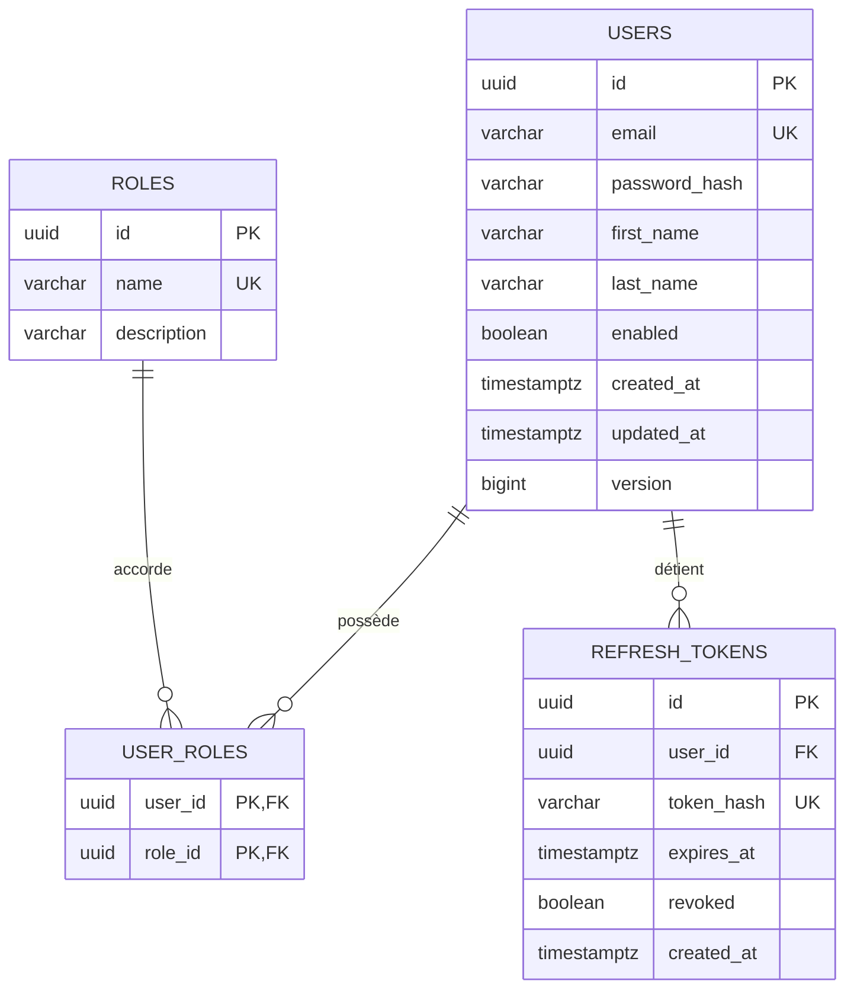
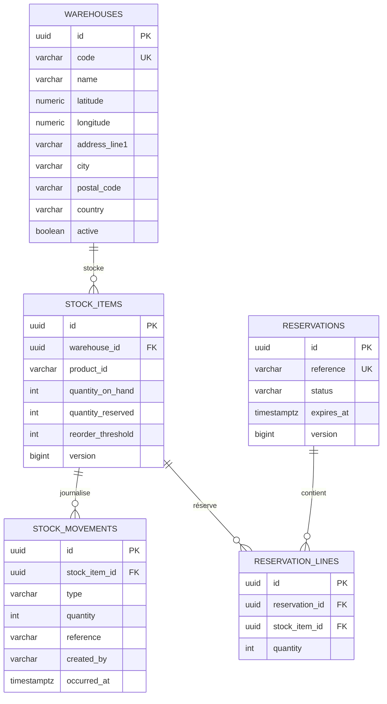

# 02 — Modèle de données par service

Conventions appliquées partout :

- Les clés primaires sont des **UUID v4**, générés par l'application (`UUID.randomUUID()`), non par la base.
  Justification : l'identifiant existe avant l'insertion, ce qui compte lorsqu'une commande et ses lignes sont
  construites en mémoire, et ces identifiants peuvent être exposés sans risque entre services.
- Chaque table modifiable porte `created_at TIMESTAMPTZ NOT NULL`, `updated_at TIMESTAMPTZ NOT NULL`
  (audit Spring Data) et, lorsqu'elle est mise à jour en concurrence, `version BIGINT` pour le
  **verrouillage optimiste**.
- Les montants sont en `NUMERIC(12,2)` avec une devise ISO-4217 `currency VARCHAR(3)` — jamais un type
  à virgule flottante.
- Les références inter-services (`product_id`, `warehouse_id`, `customer_id`) sont de simples colonnes
  `VARCHAR(36)`/`UUID` **sans clé étrangère** : elles pointent hors de la base à dessein
  (voir 01-architecture §4).
- Le schéma est créé et versionné par des migrations **Flyway** (`V1__init.sql`, …) ;
  `spring.jpa.hibernate.ddl-auto` vaut `validate` dans tous les profils, jamais `update`.

---

## 1. auth-service — PostgreSQL (`auth_db`, schéma `auth`)



### `users`

| Colonne | Type | Contraintes | Notes |
|---|---|---|---|
| `id` | `UUID` | PK | Devient le claim `sub` du JWT |
| `email` | `VARCHAR(180)` | `NOT NULL`, `UNIQUE` (mis en minuscules avant persistance) | Identifiant de connexion |
| `password_hash` | `VARCHAR(72)` | `NOT NULL` | BCrypt, force 12. Jamais renvoyé par aucun endpoint |
| `first_name` | `VARCHAR(80)` | `NOT NULL` | |
| `last_name` | `VARCHAR(80)` | `NOT NULL` | |
| `enabled` | `BOOLEAN` | `NOT NULL DEFAULT TRUE` | Désactivation logique ; un utilisateur désactivé ne peut pas obtenir de jeton |
| `created_at` / `updated_at` | `TIMESTAMPTZ` | `NOT NULL` | Audit |
| `version` | `BIGINT` | `NOT NULL DEFAULT 0` | Verrouillage optimiste |

Index : `ux_users_email` unique sur `lower(email)`.

### `roles`

| Colonne | Type | Contraintes |
|---|---|---|
| `id` | `UUID` | PK |
| `name` | `VARCHAR(40)` | `NOT NULL`, `UNIQUE` |
| `description` | `VARCHAR(160)` | |

Valeurs initialisées : `ROLE_ADMIN`, `ROLE_WAREHOUSE_MANAGER`, `ROLE_CLIENT`, `ROLE_SERVICE`.

> Les rôles vivent dans une table plutôt que dans une colonne d'énumération Java, afin qu'accorder un rôle
> soit une opération sur les données et non un déploiement. `ROLE_SERVICE` est réservé aux comptes techniques
> et ne peut jamais être auto-attribué à l'inscription — l'endpoint d'inscription force `ROLE_CLIENT`.

### `user_roles`

Table de jointure, PK composite `(user_id, role_id)`, les deux clés étrangères en `ON DELETE CASCADE`.
Plusieurs-à-plusieurs : un responsable d'entrepôt peut aussi être administrateur.

### `refresh_tokens`

| Colonne | Type | Contraintes | Notes |
|---|---|---|---|
| `id` | `UUID` | PK | |
| `user_id` | `UUID` | FK → `users(id)`, `NOT NULL` | |
| `token_hash` | `VARCHAR(64)` | `NOT NULL`, `UNIQUE` | SHA-256 du jeton opaque. Une fuite de la base ne doit pas livrer de jetons utilisables |
| `expires_at` | `TIMESTAMPTZ` | `NOT NULL` | |
| `revoked` | `BOOLEAN` | `NOT NULL DEFAULT FALSE` | Positionné à la déconnexion et à la rotation |
| `created_at` | `TIMESTAMPTZ` | `NOT NULL` | |

Index : `ix_refresh_tokens_user_id`. Une tâche planifiée supprime les lignes expirées.

---

## 2. catalog-service — MongoDB (`catalog_db`)

Deux collections. Les identifiants sont stockés en `String` (UUID) plutôt qu'en `ObjectId`, afin qu'un
identifiant de produit ait la même apparence dans tous les services et dans toutes les URL.

### Collection `products`

```json
{
  "_id": "8f2b0c3a-...-a91e",
  "sku": "PAL-TRK-2500",
  "name": "Transpalette 2500 kg",
  "description": "Transpalette manuel, fourches renforcées.",
  "brand": "Logimove",
  "categoryId": "c1a4...-77bd",
  "categoryPath": "handling/pallet-trucks",
  "price": { "amount": 349.90, "currency": "EUR" },
  "attributes": {
    "capacityKg": "2500",
    "forkLengthMm": "1150",
    "wheelMaterial": "polyuréthane"
  },
  "dimensions": { "lengthMm": 1550, "widthMm": 685, "heightMm": 1230, "weightG": 78000 },
  "images": ["https://cdn.example/pal-trk-2500.jpg"],
  "status": "ACTIVE",
  "createdAt": "2026-01-14T09:12:03Z",
  "updatedAt": "2026-02-02T15:40:11Z",
  "version": 3
}
```

| Champ | Type | Contraintes | Notes |
|---|---|---|---|
| `_id` | `String` (UUID) | PK | Exposé sous le nom `id` dans l'API |
| `sku` | `String` | requis, index unique, `^[A-Z0-9-]{3,32}$` | Clé métier lisible par un humain |
| `name` | `String` | requis, 3–160 caractères | Indexé en texte intégral |
| `description` | `String` | 4000 caractères maximum | Indexé en texte intégral |
| `brand` | `String` | facultatif | |
| `categoryId` | `String` (UUID) | requis, doit exister | Référence logique *à l'intérieur* de la même base |
| `categoryPath` | `String` | dérivé | Dénormalisé depuis la catégorie, pour afficher un fil d'Ariane sans seconde requête |
| `price.amount` | `Decimal128` | requis, `> 0` | `Decimal128`, jamais `Double` |
| `price.currency` | `String` | requis, ISO-4217 | |
| `attributes` | `Map<String,String>` | forme libre | **La raison d'être de MongoDB ici** ; validé contre l'`attributeSchema` de la catégorie |
| `dimensions` | document imbriqué | facultatif | Utilisé plus tard pour le volume d'expédition |
| `images` | `String[]` | facultatif | URL seulement, aucun binaire en base |
| `status` | énumération `String` | `ACTIVE` / `DISCONTINUED` | La suppression est logique — une commande peut référencer le produit |
| `createdAt` / `updatedAt` | `Instant` | audit | |
| `version` | `Long` | `@Version` | Verrouillage optimiste (supporté par Spring Data MongoDB) |

Index : `sku` (unique), `categoryId`, `status`, index composé `{status: 1, categoryId: 1}` pour l'écran de
listing, et un index texte sur `{name, description, brand}` pour la recherche.

### Collection `categories`

```json
{
  "_id": "c1a4...-77bd",
  "name": "Transpalettes",
  "slug": "pallet-trucks",
  "parentId": "b70f...-1c02",
  "path": "handling/pallet-trucks",
  "attributeSchema": [
    { "key": "capacityKg",   "label": "Capacité (kg)",             "type": "NUMBER",  "required": true  },
    { "key": "forkLengthMm", "label": "Longueur de fourches (mm)", "type": "NUMBER",  "required": true  },
    { "key": "wheelMaterial","label": "Matériau des roues",        "type": "STRING",  "required": false }
  ],
  "createdAt": "2026-01-10T08:00:00Z",
  "updatedAt": "2026-01-10T08:00:00Z"
}
```

| Champ | Type | Notes |
|---|---|---|
| `_id` | `String` (UUID) | PK |
| `name` | `String` | requis |
| `slug` | `String` | requis, unique |
| `parentId` | `String` | nullable → catégorie racine |
| `path` | `String` | **Chemin matérialisé** (`handling/pallet-trucks`) : toute la chaîne d'ancêtres dans un seul champ, de sorte qu'un sous-arbre se récupère par une requête de préfixe au lieu d'un parcours récursif |
| `attributeSchema` | tableau de `{key, label, type, required}` | Déclare les attributs techniques qu'un produit de cette catégorie doit porter ; `type ∈ {STRING, NUMBER, BOOLEAN}` |

Index : `slug` (unique), `parentId`, `path`.

> La hiérarchie utilise un chemin matérialisé plutôt que de simples références au parent, parce que la
> requête dominante est « tout ce qui se trouve sous cette branche », et parce que les arbres de catégories
> sont peu profonds et rarement restructurés.

---

## 3. inventory-service — PostgreSQL (`inventory_db`, schéma `inventory`)



### `warehouses`

| Colonne | Type | Contraintes | Notes |
|---|---|---|---|
| `id` | `UUID` | PK | |
| `code` | `VARCHAR(16)` | `NOT NULL`, `UNIQUE` | p. ex. `WH-CASA-01` ; repris dans les affectations de commande pour la lisibilité |
| `name` | `VARCHAR(120)` | `NOT NULL` | |
| `latitude` | `NUMERIC(9,6)` | `NOT NULL`, `CHECK BETWEEN -90 AND 90` | Entrée du calcul de distance |
| `longitude` | `NUMERIC(9,6)` | `NOT NULL`, `CHECK BETWEEN -180 AND 180` | |
| `address_line1` | `VARCHAR(180)` | `NOT NULL` | |
| `city` | `VARCHAR(80)` | `NOT NULL` | |
| `postal_code` | `VARCHAR(16)` | `NOT NULL` | |
| `country` | `VARCHAR(2)` | `NOT NULL` | ISO-3166-1 alpha-2. Pas `CHAR(2)` : CHAR complète avec des espaces, si bien qu'une valeur relue comme `'MA '` ne serait pas égale au `'MA'` écrit |
| `active` | `BOOLEAN` | `NOT NULL DEFAULT TRUE` | Un entrepôt inactif est exclu de l'affectation mais conserve son historique |
| `created_at` / `updated_at` | `TIMESTAMPTZ` | `NOT NULL` | |

`NUMERIC(9,6)` offre environ 11 cm de précision — bien au-delà de ce qu'exige un classement de distances
entre entrepôts, et exact, contrairement à un type à virgule flottante.

### `stock_items` — la table centrale

| Colonne | Type | Contraintes | Notes |
|---|---|---|---|
| `id` | `UUID` | PK | |
| `warehouse_id` | `UUID` | FK → `warehouses(id)`, `NOT NULL` | |
| `product_id` | `VARCHAR(36)` | `NOT NULL` | Référence logique vers `catalog_db.products._id` — **aucune clé étrangère** |
| `quantity_on_hand` | `INTEGER` | `NOT NULL DEFAULT 0`, `CHECK >= 0` | Physiquement présent |
| `quantity_reserved` | `INTEGER` | `NOT NULL DEFAULT 0`, `CHECK >= 0` | Promis à des réservations ouvertes |
| `reorder_threshold` | `INTEGER` | `NOT NULL DEFAULT 0`, `CHECK >= 0` | Alerte de stock faible sur le tableau de bord |
| `version` | `BIGINT` | `NOT NULL DEFAULT 0` | `@Version` JPA ; protège les chemins d'écriture à faible contention (voir ci-dessous) |
| `updated_at` | `TIMESTAMPTZ` | `NOT NULL` | |

Contraintes et index :

- `UNIQUE (warehouse_id, product_id)` — une ligne de stock par produit et par entrepôt.
- `CHECK (quantity_reserved <= quantity_on_hand)` — **l'invariant qui rend la survente impossible au niveau
  de la base**, quoi que fasse le code applicatif.
- `ix_stock_items_product_id` sur `product_id` — la requête de disponibilité filtre sur une liste
  d'identifiants produit.

**Contrôle de concurrence — pessimiste sur le chemin de réservation** (décision D11). Créer une réservation
ouvre une transaction et prend un verrou d'écriture sur chaque `stock_item` concerné via
`SELECT … FOR UPDATE`, **toujours par ordre croissant d'`id`**. Deux points à défendre en entretien :

- C'est l'ordonnancement des verrous qui supprime les interblocages : deux commandes concurrentes touchant
  les deux mêmes articles de stock ne peuvent plus détenir chacune ce que l'autre attend.
- Le verrouillage pessimiste est retenu ici *parce que* le stock est disputé précisément au moment où cela
  compte. Le verrouillage optimiste se dégraderait exactement à l'instant où les dernières unités sont
  prises, transformant une rupture de stock en tempête de reprises. La colonne `version` demeure et continue
  de protéger les chemins à faible contention (`PUT /stock`, mouvements manuels), où une mise à jour perdue
  est le seul risque réel.

La contrainte `CHECK` est la dernière ligne de défense : même si un verrou était oublié, la base refuserait
la survente.

**La quantité disponible est dérivée, jamais stockée** : `available = quantity_on_hand - quantity_reserved`.
La stocker créerait une troisième valeur à maintenir cohérente avec les deux autres.

### `stock_movements` — journal en ajout seul

| Colonne | Type | Contraintes | Notes |
|---|---|---|---|
| `id` | `UUID` | PK | |
| `stock_item_id` | `UUID` | FK → `stock_items(id)`, `NOT NULL` | |
| `type` | `VARCHAR(20)` | `NOT NULL` | `INBOUND`, `OUTBOUND`, `ADJUSTMENT`, `RESERVATION`, `RELEASE` |
| `quantity` | `INTEGER` | `NOT NULL`, `CHECK <> 0` | Signée : positive, elle augmente le stock physique ; négative, elle le diminue |
| `reference` | `VARCHAR(64)` | | Numéro de commande, identifiant de réservation ou bon de livraison fournisseur |
| `created_by` | `VARCHAR(64)` | `NOT NULL` | Identifiant utilisateur ou nom de service, extrait du JWT |
| `occurred_at` | `TIMESTAMPTZ` | `NOT NULL` | |

Les lignes ne sont **jamais mises à jour ni supprimées**. `quantity_on_hand` est la projection de ce journal,
ce qui fournit une piste d'audit complète et permet de rejouer et d'expliquer un écart. Index :
`ix_movements_item_time (stock_item_id, occurred_at DESC)`.

### `reservations` / `reservation_lines`

| Colonne | Type | Contraintes | Notes |
|---|---|---|---|
| `id` | `UUID` | PK | |
| `reference` | `VARCHAR(64)` | `NOT NULL`, `UNIQUE` | Le numéro de commande. **L'unicité est la garantie d'idempotence** : un appel rejoué ne peut pas réserver deux fois |
| `status` | `VARCHAR(16)` | `NOT NULL` | `ACTIVE`, `CONFIRMED`, `CANCELLED`, `EXPIRED` |
| `expires_at` | `TIMESTAMPTZ` | `NOT NULL` | TTL, 5 min par défaut ; une tâche planifiée libère les lignes `ACTIVE` périmées |
| `created_at` / `updated_at` | `TIMESTAMPTZ` | `NOT NULL` | |
| `version` | `BIGINT` | `NOT NULL DEFAULT 0` | |

`reservation_lines` : `id` (PK), `reservation_id` (FK, `ON DELETE CASCADE`), `stock_item_id` (FK),
`quantity` (`CHECK > 0`), `UNIQUE (reservation_id, stock_item_id)`.

---

## 4. order-service — PostgreSQL (`order_db`, schéma `orders`)


### `orders`

| Colonne | Type | Contraintes | Notes |
|---|---|---|---|
| `id` | `UUID` | PK | |
| `order_number` | `VARCHAR(20)` | `NOT NULL`, `UNIQUE` | `ORD-2026-000123`, généré depuis une séquence PostgreSQL. Identifiant public et référence de réservation |
| `customer_id` | `UUID` | `NOT NULL` | Claim `sub` du JWT. Jamais repris du corps de la requête — un client ne doit pas pouvoir commander pour le compte d'un autre |
| `status` | `VARCHAR(16)` | `NOT NULL` | `CREATED`, `ALLOCATED`, `CONFIRMED`, `SHIPPED`, `DELIVERED`, `CANCELLED`, `REJECTED` |
| `total_amount` | `NUMERIC(12,2)` | `NOT NULL`, `CHECK >= 0` | Calculé côté serveur à partir des prix instantanés ; un total fourni par le client est ignoré |
| `currency` | `VARCHAR(3)` | `NOT NULL` | |
| `delivery_line1` | `VARCHAR(180)` | `NOT NULL` | |
| `delivery_city` | `VARCHAR(80)` | `NOT NULL` | |
| `delivery_postal_code` | `VARCHAR(16)` | `NOT NULL` | |
| `delivery_country` | `VARCHAR(2)` | `NOT NULL` | |
| `delivery_latitude` | `NUMERIC(9,6)` | `NOT NULL` | Entrée de l'algorithme d'affectation |
| `delivery_longitude` | `NUMERIC(9,6)` | `NOT NULL` | |
| `allocation_strategy` | `VARCHAR(40)` | `NOT NULL` | Nom de la stratégie qui a produit le plan — **stocké pour qu'une décision passée puisse être expliquée** |
| `split_shipment` | `BOOLEAN` | `NOT NULL` | `true` lorsque plus d'un entrepôt sert la commande |
| `reservation_reference` | `VARCHAR(64)` | | Lien vers la réservation d'inventaire, pour la compensation |
| `created_at` / `updated_at` | `TIMESTAMPTZ` | `NOT NULL` | |
| `version` | `BIGINT` | `NOT NULL DEFAULT 0` | |

Index : `ix_orders_customer_created (customer_id, created_at DESC)` pour « mes commandes »,
`ix_orders_status` pour le back-office.

L'adresse de livraison est mappée comme un `@Embeddable` JPA (`DeliveryAddress`) contenant un objet-valeur
`GeoPoint` imbriqué — une seule table, mais un modèle de domaine riche.

### `order_lines`

| Colonne | Type | Contraintes | Notes |
|---|---|---|---|
| `id` | `UUID` | PK | |
| `order_id` | `UUID` | FK → `orders(id)`, `ON DELETE CASCADE`, `NOT NULL` | |
| `product_id` | `VARCHAR(36)` | `NOT NULL` | Référence logique vers le catalogue |
| `product_sku` | `VARCHAR(32)` | `NOT NULL` | **Instantané** |
| `product_name` | `VARCHAR(160)` | `NOT NULL` | **Instantané** |
| `unit_price` | `NUMERIC(12,2)` | `NOT NULL`, `CHECK > 0` | **Instantané — le prix au moment de la commande, jamais relu** |
| `quantity` | `INTEGER` | `NOT NULL`, `CHECK > 0` | |
| `line_total` | `NUMERIC(12,2)` | `NOT NULL` | `unit_price * quantity`, stocké pour garder le total auditable |

`UNIQUE (order_id, product_id)` — un même produit ne peut pas figurer sur deux lignes ; les doublons dans la
requête sont rejetés par un 400 plutôt que fusionnés silencieusement.

### `order_allocations` / `order_allocation_lines` — la sortie de l'algorithme, persistée

| Colonne | Type | Notes |
|---|---|---|
| `order_allocations.warehouse_id` | `UUID` | Référence logique vers `inventory_db.warehouses` |
| `order_allocations.warehouse_code` | `VARCHAR(16)` | Instantané, pour que la commande s'affiche sans appeler `inventory-service` |
| `order_allocations.shipment_sequence` | `INTEGER` | 1, 2, 3… — une expédition par entrepôt affecté |
| `order_allocations.distance_km` | `NUMERIC(8,2)` | Distance utilisée par la décision ; conservée pour la traçabilité |
| `order_allocation_lines.quantity` | `INTEGER` | `CHECK > 0` — quelle part de cette ligne de commande cet entrepôt expédie |

`UNIQUE (order_id, warehouse_id)` et `UNIQUE (allocation_id, order_line_id)`.

Invariant métier, vérifié dans le domaine et couvert par un test :
**pour chaque ligne de commande, la somme des `order_allocation_lines.quantity` égale
`order_lines.quantity`.**

### `order_status_history`

`id`, `order_id` (FK), `from_status`, `to_status`, `reason` (p. ex. *« stock insuffisant dans tous les
entrepôts »*), `changed_at`, `changed_by`. En ajout seul. Rend le cycle de vie auditable et donne à
l'interface une véritable chronologie.

---

## 5. Récapitulatif des références inter-services

| De | Vers | Colonne / champ | Garanti par |
|---|---|---|---|
| `inventory.stock_items.product_id` | `catalog.products._id` | `VARCHAR(36)` | Contrôle applicatif à la création d'un article de stock |
| `orders.order_lines.product_id` | `catalog.products._id` | `VARCHAR(36)` | `order-service` résout le lot auprès de `catalog-service` avant de persister |
| `orders.order_allocations.warehouse_id` | `inventory.warehouses.id` | `UUID` | Renvoyé par `inventory-service` dans la réponse de disponibilité |
| `orders.orders.customer_id` | `auth.users.id` | `UUID` | Claim `sub` du JWT, vérifié par signature |
| `inventory.reservations.reference` | `orders.orders.order_number` | `VARCHAR(64)` | Clé d'idempotence de la saga |
