# 03 — order-service Design (UML class diagram + allocation engine)

This is the service that carries the value of the project. Everything else exists so that this algorithm has
realistic inputs.

## 1. Class diagram

```mermaid
classDiagram
    direction TB

    %% ---------- Presentation layer ----------
    class OrderController {
        -OrderService orderService
        -AllocationPreviewService previewService
        +createOrder(CreateOrderRequest, Authentication) ResponseEntity~OrderResponse~
        +getOrder(UUID, Authentication) OrderResponse
        +listOrders(OrderFilter, Pageable, Authentication) PagedResponse~OrderSummaryResponse~
        +cancelOrder(UUID, Authentication) OrderResponse
        +updateStatus(UUID, UpdateOrderStatusRequest) OrderResponse
        +previewAllocation(AllocationPreviewRequest) AllocationPreviewResponse
    }
    class GlobalExceptionHandler {
        +handleNotFound(ResourceNotFoundException) ProblemDetail
        +handleAllocationFailed(AllocationFailedException) ProblemDetail
        +handleValidation(MethodArgumentNotValidException) ProblemDetail
        +handleIllegalTransition(IllegalOrderStateException) ProblemDetail
        +handleUpstream(UpstreamServiceException) ProblemDetail
    }

    %% ---------- Application layer ----------
    class OrderService {
        <<interface>>
        +create(CreateOrderCommand) Order
        +findById(UUID, UserContext) Order
        +search(OrderFilter, Pageable, UserContext) Page~Order~
        +cancel(UUID, UserContext) Order
        +changeStatus(UUID, OrderStatus, UserContext) Order
    }
    class OrderServiceImpl {
        -OrderRepository orderRepository
        -OrderNumberGenerator numberGenerator
        -CatalogClient catalogClient
        -InventoryClient inventoryClient
        -AllocationStrategyResolver strategyResolver
        -OrderStatusHistoryRecorder historyRecorder
        +create(CreateOrderCommand) Order
    }
    class AllocationStrategyResolver {
        -Map~String, WarehouseAllocationStrategy~ strategies
        -String defaultStrategyName
        +resolve(String name) WarehouseAllocationStrategy
        +availableStrategies() Set~String~
    }

    %% ---------- Allocation engine (domain, pure) ----------
    class WarehouseAllocationStrategy {
        <<interface>>
        +name() String
        +allocate(AllocationRequest) AllocationPlan
    }
    class AbstractAllocationStrategy {
        <<abstract>>
        #DistanceCalculator distanceCalculator
        +allocate(AllocationRequest) AllocationPlan
        #fullCoverageComparator(AllocationRequest) Comparator~WarehouseCandidate~
        #splitComparator(AllocationRequest) Comparator~WarehouseCandidate~
        #allowsSplit() boolean
    }
    class NearestWarehouseAllocationStrategy {
        +name() String
        #fullCoverageComparator(AllocationRequest) Comparator~WarehouseCandidate~
        #splitComparator(AllocationRequest) Comparator~WarehouseCandidate~
    }
    class SingleShipmentAllocationStrategy {
        +name() String
        #fullCoverageComparator(AllocationRequest) Comparator~WarehouseCandidate~
        #splitComparator(AllocationRequest) Comparator~WarehouseCandidate~
    }
    class DistanceCalculator {
        <<interface>>
        +distanceKm(GeoPoint from, GeoPoint to) double
    }
    class HaversineDistanceCalculator {
        +distanceKm(GeoPoint from, GeoPoint to) double
    }

    class AllocationRequest {
        <<record>>
        +List~RequestedLine~ lines
        +GeoPoint destination
        +List~WarehouseCandidate~ candidates
    }
    class RequestedLine {
        <<record>>
        +UUID orderLineId
        +String productId
        +int quantity
    }
    class WarehouseCandidate {
        <<record>>
        +UUID warehouseId
        +String warehouseCode
        +GeoPoint location
        +Map~String, Integer~ availableByProduct
        +available(String productId) int
        +canCoverFully(List~RequestedLine~) boolean
        +residualAfter(List~RequestedLine~) long
    }
    class AllocationPlan {
        <<record>>
        +String strategyName
        +boolean splitShipment
        +List~AllocationSegment~ segments
        +validateCovers(List~RequestedLine~) void
    }
    class AllocationSegment {
        <<record>>
        +UUID warehouseId
        +String warehouseCode
        +double distanceKm
        +int shipmentSequence
        +List~SegmentLine~ lines
    }
    class SegmentLine {
        <<record>>
        +UUID orderLineId
        +String productId
        +int quantity
    }
    class AllocationFailedException {
        +List~UnsatisfiedLine~ unsatisfied
    }

    %% ---------- Domain model ----------
    class Order {
        -UUID id
        -String orderNumber
        -UUID customerId
        -OrderStatus status
        -Money total
        -DeliveryAddress deliveryAddress
        -String allocationStrategy
        -boolean splitShipment
        -String reservationReference
        -List~OrderLine~ lines
        -List~OrderAllocation~ allocations
        +addLine(OrderLine) void
        +applyAllocation(AllocationPlan) void
        +transitionTo(OrderStatus, String reason) void
        +recomputeTotal() void
        +isOwnedBy(UUID customerId) boolean
    }
    class OrderLine {
        -UUID id
        -String productId
        -String productSku
        -String productName
        -Money unitPrice
        -int quantity
        +lineTotal() Money
    }
    class OrderAllocation {
        -UUID id
        -UUID warehouseId
        -String warehouseCode
        -int shipmentSequence
        -BigDecimal distanceKm
        -List~OrderAllocationLine~ lines
    }
    class OrderAllocationLine {
        -UUID id
        -OrderLine orderLine
        -int quantity
    }
    class OrderStatus {
        <<enumeration>>
        CREATED
        ALLOCATED
        CONFIRMED
        SHIPPED
        DELIVERED
        CANCELLED
        REJECTED
        +canTransitionTo(OrderStatus) boolean
    }
    class DeliveryAddress {
        <<embeddable>>
        -String line1
        -String city
        -String postalCode
        -String country
        -GeoPoint location
    }
    class GeoPoint {
        <<embeddable>>
        -BigDecimal latitude
        -BigDecimal longitude
    }
    class Money {
        <<embeddable>>
        -BigDecimal amount
        -String currency
        +add(Money) Money
        +multiply(int) Money
    }

    %% ---------- Infrastructure ----------
    class OrderRepository {
        <<interface>>
        +findByOrderNumber(String) Optional~Order~
        +findByCustomerId(UUID, Pageable) Page~Order~
        +existsByOrderNumber(String) boolean
    }
    class CatalogClient {
        <<interface>>
        +fetchProducts(Set~String~ productIds) Map~String, ProductSnapshot~
    }
    class CatalogRestClient {
        -RestClient restClient
        +fetchProducts(Set~String~) Map~String, ProductSnapshot~
    }
    class InventoryClient {
        <<interface>>
        +fetchAvailability(Set~String~ productIds) List~WarehouseCandidate~
        +reserve(ReservationCommand) ReservationHandle
        +confirm(UUID reservationId) void
        +cancel(UUID reservationId) void
    }
    class InventoryRestClient {
        -RestClient restClient
        -ServiceTokenProvider tokenProvider
    }
    class OrderMapper {
        <<interface>>
        +toResponse(Order) OrderResponse
        +toSummary(Order) OrderSummaryResponse
        +toCommand(CreateOrderRequest, UUID customerId) CreateOrderCommand
    }

    %% ---------- Relations ----------
    OrderController --> OrderService : uses
    OrderController --> OrderMapper : uses
    OrderServiceImpl ..|> OrderService
    OrderServiceImpl --> OrderRepository
    OrderServiceImpl --> CatalogClient
    OrderServiceImpl --> InventoryClient
    OrderServiceImpl --> AllocationStrategyResolver
    AllocationStrategyResolver o-- WarehouseAllocationStrategy : registry
    AbstractAllocationStrategy ..|> WarehouseAllocationStrategy
    NearestWarehouseAllocationStrategy --|> AbstractAllocationStrategy
    SingleShipmentAllocationStrategy --|> AbstractAllocationStrategy
    AbstractAllocationStrategy --> DistanceCalculator
    HaversineDistanceCalculator ..|> DistanceCalculator
    AbstractAllocationStrategy ..> AllocationRequest : consumes
    AbstractAllocationStrategy ..> AllocationPlan : produces
    AbstractAllocationStrategy ..> AllocationFailedException : throws
    AllocationRequest *-- RequestedLine
    AllocationRequest *-- WarehouseCandidate
    AllocationPlan *-- AllocationSegment
    AllocationSegment *-- SegmentLine
    Order *-- OrderLine
    Order *-- OrderAllocation
    OrderAllocation *-- OrderAllocationLine
    OrderAllocationLine --> OrderLine
    Order --> OrderStatus
    Order *-- DeliveryAddress
    DeliveryAddress *-- GeoPoint
    OrderLine *-- Money
    Order ..> AllocationPlan : applies
    CatalogRestClient ..|> CatalogClient
    InventoryRestClient ..|> InventoryClient
```



### Why the diagram looks like this

- **The engine is pure.** `AbstractAllocationStrategy` takes an `AllocationRequest` (plain records) and
  returns an `AllocationPlan`. No repository, no HTTP client, no Spring annotation, no clock. Consequence:
  every allocation scenario is a plain JUnit test with no mock and no container — this is the part an
  interviewer will ask to see tested.
- **The domain is not anaemic.** `Order.applyAllocation(...)`, `Order.transitionTo(...)` and
  `OrderStatus.canTransitionTo(...)` hold the rules; the service layer orchestrates but does not decide.
- **Records for the engine, entities for persistence.** The allocation types are immutable `record`s
  (Java 17), which removes a whole class of accidental-mutation bugs.
- **Two ports, two adapters.** `CatalogClient` and `InventoryClient` are domain-owned interfaces; the
  `*RestClient` classes are the only place that knows about HTTP, JSON and other services' URLs.

## 2. The allocation algorithm

### 2.1 Inputs and outputs

```
INPUT   lines        : [(orderLineId, productId, quantity)]           -- required quantities
        destination  : (latitude, longitude)                          -- delivery point
        candidates   : [(warehouseId, code, location, available{productId -> qty})]
                       available = quantity_on_hand - quantity_reserved, active warehouses only

OUTPUT  AllocationPlan(strategyName, splitShipment, segments[])
        segment = (warehouseId, code, distanceKm, shipmentSequence, lines[(orderLineId, productId, qty)])

ERROR   AllocationFailedException(unsatisfied[]) when the total available quantity across all
        warehouses is lower than what the order requires
```

### 2.2 Shared skeleton (Template Method — `AbstractAllocationStrategy.allocate`)

```
STEP 0  Reject empty requests and non-positive quantities        -> IllegalArgumentException (guarded earlier by @Valid)

STEP 1  ELIGIBILITY
        candidates := candidates where warehouse is active
                      and contributes at least one unit to at least one line
        if candidates is empty                                    -> throw AllocationFailedException(all lines)

STEP 2  FULL-COVERAGE SET
        full := { w in candidates | for every line l : w.available(l.productId) >= l.quantity }

STEP 3  SINGLE-SHIPMENT CASE  (preferred)
        if full is not empty:
            best := min(full, fullCoverageComparator)              -- supplied by the subclass
            return AllocationPlan(name, splitShipment = false,
                                  [ segment(best, all lines, seq = 1) ])

STEP 4  SPLIT CASE
        if not allowsSplit()                                       -> throw AllocationFailedException(all lines)
        remaining := mutable copy of lines
        ordered   := sort(candidates, splitComparator)             -- supplied by the subclass
        segments  := []
        seq       := 1
        for w in ordered:
            taken := []
            for l in remaining where l.remaining > 0:
                q := min(l.remaining, w.available(l.productId))
                if q > 0:
                    taken.add((l.orderLineId, l.productId, q))
                    l.remaining -= q
            if taken is not empty:
                segments.add(segment(w, taken, seq)); seq += 1
            if all remaining == 0: break

STEP 5  FEASIBILITY CHECK
        if any remaining > 0                                       -> throw AllocationFailedException(remaining)
        return AllocationPlan(name, splitShipment = segments.size > 1, segments)

POST-CONDITION (asserted by AllocationPlan.validateCovers)
        for every line l : sum of allocated quantities over all segments == l.quantity
```

Complexity: `O(W log W + W x L)` where `W` = number of warehouses and `L` = number of order lines. Sorting
dominates. For realistic sizes (tens of warehouses, tens of lines) this is negligible, and the whole
computation happens in memory from a single availability snapshot — **one remote call, not one per
warehouse**.

### 2.3 The two interchangeable implementations

Both subclasses implement the same interface and differ **only** in two comparators — which is the entire
point of the Template Method split.

#### `NearestWarehouseAllocationStrategy` (`nearest`, default)

Optimises **delivery time and transport cost**: walk the sites from nearest to farthest, taking whatever
each can give, until the order is filled.

| Order of comparison | Criterion | Direction | Rationale |
|---|---|---|---|
| 1 | Haversine distance to the delivery point | ascending | Closest warehouse ships fastest and cheapest |
| 2 | Coverage of the order | descending | At equal distance, the site that gives more avoids a pointless extra shipment |
| 3 | Warehouse code | ascending | **Deterministic tie-break — makes the algorithm reproducible and testable** |

The trade-off is explicit: this strategy will split an order across two nearby sites even when a single,
slightly more distant warehouse could have shipped it whole. That is right when transport is billed by
distance, and wrong when it is billed per shipment — which is exactly why the second strategy exists.

#### `SingleShipmentAllocationStrategy` (`single-shipment`)

Optimises the **number of parcels** rather than the kilometres they travel. One shipment means one picking
run, one packing slip, one carrier handover, and one delivery for the customer to wait in for.

Two phases:

1. **Single shipment.** If any warehouse can cover every line on its own, use it — the closest such site.
   This is the case the strategy exists for, and it will take a *farther* warehouse to get it.
2. **Fewest shipments.** Otherwise, greedily take the warehouse covering the most of what remains, and
   repeat. That is the standard greedy heuristic for set cover: not provably optimal, but the exact problem
   is NP-hard and an exhaustive search over warehouse subsets has no place on an order-placement request.

| Order of comparison | Criterion | Direction | Rationale |
|---|---|---|---|
| 1 | Coverage of what is still outstanding | descending | Fewer units left over means fewer shipments |
| 2 | Haversine distance | ascending | Among equally useful sites, still prefer the nearest |
| 3 | Warehouse code | ascending | Deterministic tie-break |

Coverage is recomputed against what is *still* outstanding after each pick, not ranked once upfront: a
static ranking would keep favouring a warehouse holding a product already fully allocated.

**The contrast is the point.** On the same order and the same stock, `nearest` splits across two close
sites while `single-shipment` sends one parcel from a farther one. Both plans are complete and correct;
each is better on the axis it optimises. **A third strategy (`cheapest`, `fastest-carrier`, …) is a new
class plus a `@Component` annotation — no existing class changes.** That is the Open/Closed principle,
concretely.

### 2.4 Strategy selection (Registry / Factory)

Spring injects `List<WarehouseAllocationStrategy>` into `AllocationStrategyResolver`, which indexes them by
`name()`. Selection order:

1. The `strategy` field of the request, when present and known — used by the back-office and by the
   `/allocation-preview` endpoint to compare both strategies on the same order.
2. Otherwise the configured default: `logistics.allocation.default-strategy=nearest`.
3. An unknown name yields a `400` problem listing the available strategies (never a silent fallback).

The strategy name is **persisted on the order** (`orders.allocation_strategy`), so a past decision can be
explained months later.

### 2.5 Edge cases and how each is handled

| Case | Handling |
|---|---|
| Empty order / quantity ≤ 0 | Rejected by `@Valid` before reaching the engine → `400` |
| Duplicate `productId` in the request | Rejected → `400` (merging silently would hide a client bug) |
| Unknown or `DISCONTINUED` product | `catalog-service` lookup fails the batch → `422` naming the offending ids |
| No warehouse holds any of the products | `AllocationFailedException` with every line unsatisfied → `409` |
| Partial availability across the network | Split plan over several warehouses |
| Total availability lower than required | `AllocationFailedException` with the unsatisfied lines → `409`, order stored as `REJECTED` with a reason |
| Every warehouse inactive | Treated as "no candidate" → `409` |
| Stock changed between snapshot and reservation | `inventory-service` returns `409`; `OrderServiceImpl` re-reads availability and retries the allocation **once**, then rejects. Bounded retry — no infinite loop |
| Two identical orders submitted concurrently | Independent order numbers → independent reservations; the `CHECK` constraint arbitrates, the loser gets `409` |
| Retry of the *same* order creation | Reservation `reference` is unique → idempotent, no double reservation |

### 2.6 Worked example (illustrative, not benchmark data)

Order: 10 × `P1`, 4 × `P2`. Destination: Casablanca (33.5731, −7.5898).

| Warehouse | Location | `P1` available | `P2` available | Distance (km) |
|---|---|---|---|---|
| `WH-CASA-01` | Casablanca | 6 | 10 | 4 |
| `WH-RABA-01` | Rabat | 12 | 9 | 87 |
| `WH-TANG-01` | Tangier | 20 | 0 | 340 |

- **Step 2** — full coverage: `WH-CASA-01` fails on `P1` (6 < 10), `WH-TANG-01` fails on `P2` (0 < 4).
  Only `WH-RABA-01` covers everything.
- **Step 3** — `nearest` returns a **single shipment from `WH-RABA-01`** even though Casablanca is closer:
  covering the order in one shipment outranks distance, exactly as the rule requires.
- With `WH-RABA-01` set inactive, the full-coverage set is empty and `nearest` falls back to a **split**:
  `WH-CASA-01` ships 6 × `P1` + 4 × `P2`, then `WH-TANG-01` ships the remaining 4 × `P1`.
- On the same input, `single-shipment` refuses to split at all while any one site can cover the order:
  it ships everything from `WH-RABA-01` even when Casablanca is nearer, and only falls back to the
  fewest-shipments split when no site can. Same input, two defensible plans — which is the demonstration
  that the strategies are genuinely interchangeable.

## 3. Order state machine

`OrderStatus.canTransitionTo` is a static transition table; `Order.transitionTo` refuses an illegal move with
`IllegalOrderStateException` → `409`. Every accepted transition appends a row to `order_status_history`.

| From | Allowed targets | Trigger |
|---|---|---|
| `CREATED` | `ALLOCATED`, `REJECTED` | Reservation succeeded / allocation impossible |
| `ALLOCATED` | `CONFIRMED`, `CANCELLED` | Reservation confirmed / compensation |
| `CONFIRMED` | `SHIPPED`, `CANCELLED` | Warehouse manager / cancellation with compensating inbound movement |
| `SHIPPED` | `DELIVERED` | Warehouse manager |
| `DELIVERED`, `CANCELLED`, `REJECTED` | — | Terminal |

> A full **State pattern** (one class per status) was considered and rejected: with seven statuses and no
> behaviour varying beyond the permitted transitions, a transition table is simpler and easier to read. Worth
> saying out loud in an interview — knowing when *not* to apply a pattern is part of the answer.
