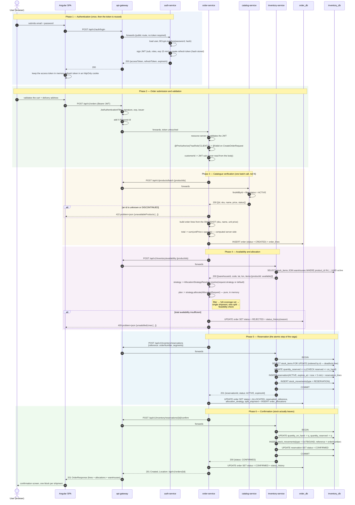

# 04 — Sequence: "Create an order", end to end

Scenario covered: authentication, catalogue verification, availability check, warehouse allocation, stock
reservation, stock decrement, confirmation — plus the failure paths, because a saga is only credible when its
compensations are drawn.

## 1. Nominal flow



### What the numbered steps demonstrate

| Step | Point being made |
|---|---|
| 8 | The refresh token never reaches JavaScript (httpOnly cookie); the access token is short-lived and kept in memory only |
| 11–13 | Double validation: the gateway authenticates, the service authorises. Removing the gateway would not open a hole |
| 14 | `customerId` comes from the signed token, never from the request body — otherwise anyone could order on someone else's account |
| 16–20 | **One batch call** rather than one call per product: the N+1 problem exists over HTTP too |
| 21–22 | The order stores a **price snapshot**; a later catalogue price change does not rewrite history, and the total is server-computed |
| 25–27 | **One availability call** returning stock *and* warehouse coordinates, so the engine needs no second round trip |
| 29 | The allocation itself is pure and in-memory — the only part of the flow that is unit-testable with no infrastructure |
| 35–40 | The reservation is a single ACID transaction with rows locked in a **stable order** (by id), which removes deadlocks between concurrent orders |
| 45–48 | On-hand stock decreases only at confirmation; the ledger (`stock_movements`) records every step |

## 2. Failure paths and compensations

```mermaid
sequenceDiagram
    autonumber
    participant OR as order-service
    participant IN as inventory-service
    participant PG as order_db

    rect rgb(253, 240, 240)
    note over OR, IN: Case A — stock taken by another order between snapshot and reservation
    OR->>IN: POST /reservations
    IN-->>OR: 409 insufficient stock {productId, warehouseId}
    OR->>IN: POST /inventory/availability (fresh snapshot)
    IN-->>OR: 200 updated availability
    OR->>OR: re-run allocate() — bounded retry, ONCE
    alt the second attempt succeeds
        OR->>IN: POST /reservations
        IN-->>OR: 201
    else it fails again
        OR->>PG: status = REJECTED, reason = "stock unavailable"
        OR-->>OR: 409 to the client
    end
    end

    rect rgb(253, 244, 236)
    note over OR, IN: Case B — confirmation fails (inventory-service down or timeout)
    OR->>IN: POST /reservations/{id}/confirm
    IN --x OR: timeout / 5xx
    OR->>IN: POST /reservations/{id}/cancel  (compensating action)
    alt cancellation succeeds
        IN-->>OR: 200 CANCELLED, quantity_reserved -= q
    else cancellation also fails
        note over IN: the reservation TTL expires it automatically<br/>(scheduled job) — stock is never lost
    end
    OR->>PG: status = CANCELLED, reason = "inventory unavailable"
    OR-->>OR: 503 to the client
    end

    rect rgb(240, 240, 250)
    note over OR, IN: Case C — order-service crashes between reservation and confirmation
    note over IN: reservation stays ACTIVE with expires_at
    note over IN: the scheduled job flips it to EXPIRED and releases quantity_reserved
    note over PG: the order stays ALLOCATED; a reconciliation job cancels<br/>orders left in ALLOCATED past the TTL
    end
```

**Why this is enough here.** No message broker, no event sourcing, no distributed transaction manager: the
combination of an *idempotent* reservation (unique `reference`), a *bounded* retry, an explicit *compensating
action*, and a *TTL* as the last line of defence keeps stock consistent without introducing infrastructure
the project does not need. The honest limitation, worth stating rather than hiding: a network partition at
the exact moment of confirmation can leave the order in `ALLOCATED` until the reconciliation job runs. That
is eventual consistency, and it is a deliberate trade-off.

## 3. Non-obvious decisions in this flow

1. **The order is persisted as `CREATED` *before* allocation.** A failed allocation still leaves a `REJECTED`
   order with its reason — a customer can be told why, and the case can be analysed. Discarding the attempt
   would destroy that information.
2. **Confirmation is immediate, in the same use case.** A real e-commerce system would confirm at payment,
   keeping the reservation `ACTIVE` in between. The protocol here is already the right one; only the trigger
   would change. Adding a payment step later means calling `confirm` from another handler — no redesign.
3. **The retry is bounded to one attempt.** Retrying indefinitely under contention turns a stockout into a
   thundering herd. One retry absorbs the ordinary race; a second failure is genuine unavailability.
4. **`X-Request-Id` propagates through every hop** and appears in every log line and every error body — with
   four services, a support case is unusable without it.
