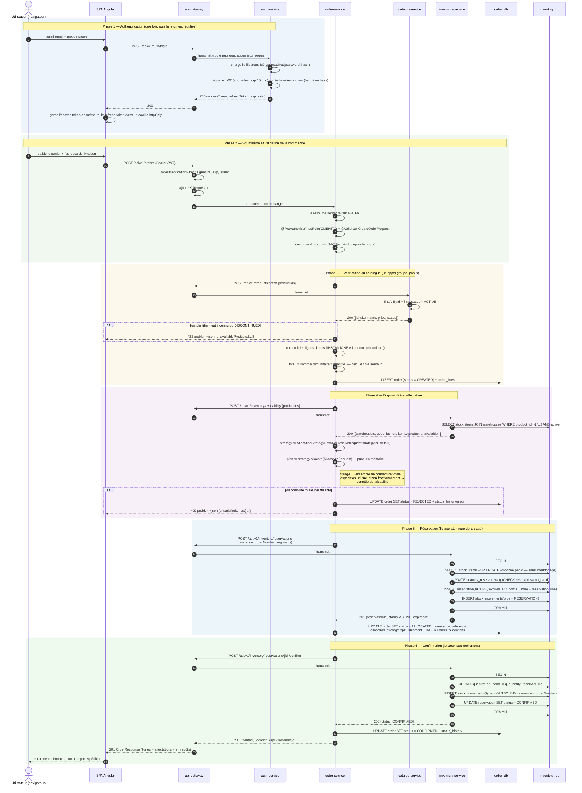

# 04 — Séquence : « Créer une commande », de bout en bout

Scénario couvert : authentification, vérification du catalogue, contrôle de disponibilité, affectation aux
entrepôts, réservation de stock, décrément du stock, confirmation — ainsi que les chemins d'échec, car une
saga n'est crédible que lorsque ses compensations sont dessinées.

## 1. Flux nominal



### Ce que démontrent les étapes numérotées

| Étape | Point démontré |
|---|---|
| 8 | Le refresh token n'atteint jamais JavaScript (cookie httpOnly) ; l'access token est à durée courte et reste en mémoire uniquement |
| 11–13 | Double validation : la gateway authentifie, le service autorise. Retirer la gateway n'ouvrirait aucune brèche |
| 14 | Le `customerId` provient du jeton signé, jamais du corps de la requête — sans quoi n'importe qui pourrait commander sur le compte d'autrui |
| 16–20 | **Un seul appel groupé** plutôt qu'un appel par produit : le problème N+1 existe aussi en HTTP |
| 21–22 | La commande stocke un **instantané des prix** ; un changement de tarif ultérieur au catalogue ne réécrit pas l'histoire, et le total est calculé côté serveur |
| 25–27 | **Un seul appel de disponibilité** renvoyant le stock *et* les coordonnées des entrepôts, pour que le moteur n'ait aucun second aller-retour à faire |
| 29 | L'affectation elle-même est pure et en mémoire — la seule partie du flux testable unitairement sans aucune infrastructure |
| 35–40 | La réservation est une transaction ACID unique, avec les lignes verrouillées dans un **ordre stable** (par id), ce qui supprime les interblocages entre commandes concurrentes |
| 45–48 | Le stock physique ne décroît qu'à la confirmation ; le journal (`stock_movements`) enregistre chaque étape |

## 2. Chemins d'échec et compensations

```mermaid
sequenceDiagram
    autonumber
    participant OR as order-service
    participant IN as inventory-service
    participant PG as order_db

    rect rgb(253, 240, 240)
    note over OR, IN: Cas A — stock pris par une autre commande entre l'instantané et la réservation
    OR->>IN: POST /reservations
    IN-->>OR: 409 stock insuffisant {productId, warehouseId}
    OR->>IN: POST /inventory/availability (nouvel instantané)
    IN-->>OR: 200 disponibilité actualisée
    OR->>OR: rejoue allocate() — nouvelle tentative bornée, UNE SEULE FOIS
    alt la seconde tentative réussit
        OR->>IN: POST /reservations
        IN-->>OR: 201
    else elle échoue de nouveau
        OR->>PG: status = REJECTED, motif = "stock indisponible"
        OR-->>OR: 409 renvoyé au client
    end
    end

    rect rgb(253, 244, 236)
    note over OR, IN: Cas B — la confirmation échoue (inventory-service arrêté ou en timeout)
    OR->>IN: POST /reservations/{id}/confirm
    IN --x OR: timeout / 5xx
    OR->>IN: POST /reservations/{id}/cancel  (action compensatoire)
    alt l'annulation réussit
        IN-->>OR: 200 CANCELLED, quantity_reserved -= q
    else l'annulation échoue aussi
        note over IN: le TTL de la réservation l'expire automatiquement<br/>(tâche planifiée) — le stock n'est jamais perdu
    end
    OR->>PG: status = CANCELLED, motif = "inventaire indisponible"
    OR-->>OR: 503 renvoyé au client
    end

    rect rgb(240, 240, 250)
    note over OR, IN: Cas C — order-service tombe entre la réservation et la confirmation
    note over IN: la réservation reste ACTIVE avec son expires_at
    note over IN: la tâche planifiée la bascule en EXPIRED et libère quantity_reserved
    note over PG: la commande reste ALLOCATED ; une tâche de réconciliation annule<br/>les commandes laissées en ALLOCATED au-delà du TTL
    end
```

**Pourquoi cela suffit ici.** Aucun broker de messages, aucun event sourcing, aucun gestionnaire de
transactions distribuées : la combinaison d'une réservation *idempotente* (`reference` unique), d'une
tentative de reprise *bornée*, d'une *action compensatoire* explicite et d'un *TTL* en dernière ligne de
défense maintient la cohérence du stock sans introduire une infrastructure dont le projet n'a pas besoin. La
limite honnête, qu'il vaut mieux énoncer que masquer : une partition réseau à l'instant précis de la
confirmation peut laisser la commande en `ALLOCATED` jusqu'au passage de la tâche de réconciliation. C'est de
la cohérence à terme, et c'est un compromis assumé.

## 3. Décisions non évidentes dans ce flux

1. **La commande est persistée en `CREATED` *avant* l'affectation.** Une affectation échouée laisse malgré
   tout une commande `REJECTED` avec son motif — le client peut savoir pourquoi, et le cas peut être analysé.
   Abandonner la tentative détruirait cette information.
2. **La confirmation est immédiate, dans le même cas d'utilisation.** Un vrai système e-commerce confirmerait
   au paiement, en gardant la réservation `ACTIVE` entre-temps. Le protocole retenu ici est déjà le bon ;
   seul le déclencheur changerait. Ajouter une étape de paiement plus tard revient à appeler `confirm` depuis
   un autre handler — aucune refonte.
3. **La reprise est bornée à une tentative.** Réessayer indéfiniment sous contention transforme une rupture
   de stock en effet d'avalanche. Une reprise absorbe la course ordinaire ; un second échec traduit une
   indisponibilité réelle.
4. **`X-Request-Id` se propage à chaque saut** et apparaît dans chaque ligne de journal et chaque corps
   d'erreur — avec quatre services, un ticket de support est inexploitable sans lui.
